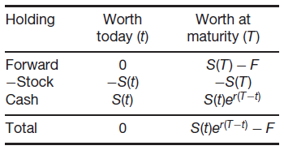

# 1 Equities
> Equity represents the ownership of a small piece of a company.

**Equity / stock / share** is the most basic form of financial instruments. The idea behind it is that people / company who has a bright idea raise capital by selling off shares (i.e. partial ownership) of their company. These shares represent entitlement to future profits of the company (and other things like voting rights).

## 1.1 Dividends
> Value in holding the stock comes from dividends and growth in stock value.

Dividends are lump sum payments from the company to shareholders paid out quarterly or every six months. The amount of dividend paid varies from time to time depending on the company's profitability. However, in general, companies try to keep level of dividends about the same each time. The dividend amount is decided by the board of directors usually a month or so before the payment.

> At ex dvvidend date, share prices drop.

When stocks are bought (on the open market), it either comes with (**cum**) or without (**ex**) entitlement to the next dividend. Stocks purchased after the **ex dividend date** are not entitled to the next dividend payment. Ex dividend date is usually set one day before the record day. As such, the stock's price should drop by (around) the amount of dividend at ex dividend date.

## 1.2 Stock Splits
Every now and then companies announce a stock split (n-for-one) to lower the stock price. This is mainly due to psychological factors.

# 2 Commodities
> Most commodities trading is done on the futures market.

Commodities are usually raw products such as precious metals, oil, food etc. The prices of these products are unpredictable but often seasonal. Spot market of commodities are usually for speculators who have no need of the raw material (cuz people who need it buys the actual stuff, not a piece of ownership). People who need the raw material usually trade in the futures market to hedge in prices (reduce losses from potential price spike in the future). Of course, it can also end up increasing losses (e.g. Cathay over hedging their oil).

# 3 Currencies
> Exchange rates and interest (inflation) rates are linked (higher interest rate = higher returns = more valuable).

Currencies / foreign exchanges are also be traded. Some currencies are pegged to others and some currencies are restricted (e.g. Taiwan dollar and Korean dollar). Though unpredictable, forex prices are usually affected by the interest rates in the two countries.

# 4 Indices
> Indices are a form of performance measure created by the weighted sum of a selection of stock.

An index is a weighted sum of a selection of representative stocks. Indices serve the purpose of measuring how the stock market / sector / economy (or whatever kind of meta-data) is performing.

When it comes to interest rates, there are also standardized interest rates such as LIBOR and HIBOR which are used as the floating portion of other interest rates (e.g. mortgages).

# 5 Time Value of Money
> $1 today is different from $1 tomorrow as they have different expected purchasing power (which is a function of interest rate, inflation and risk).

**Interest Rate**: Imagine you have $1 today, and interest rate is 50%. You would own $1.5 tomorrow. Hence, if I borrow $1 from you today, I would be expected to pay you back $1.5 the next day.

**Inflation**: However, if there is a deflation of 50%. I would only be paying you back $1 tomorrow.

**Risk**: Furthermore, if there is a 50% chance that I would default on my $1 debt. You would require a repayment of $2 in order to lend it to me (so that you expect to receive back $1).

The time value of money can be evaluated discretely (compounding) or continuously (exponential).

*Note that there are other factors that affect the short-term prices of financial instruments (e.g. the demand for liquidity). However, from the expected value point of view, these are pretty much the main factors.*

# 6 Fixed-Income Securities
> Fixed-income securities has a minimum guaranteed rate of return (i.e. constant drift).

Fixed-income securities are basically loans. When you lend money to another party (government / corporations), they pay you back a **fixed / floating** interest rate. For couple-bearing bonds, they pay out a fixed amount every six or twelve months (which is the fixed rate of interest). 

There are also derivatives called interest rate swaps that exchange a fixed rate debt for a floating rate debt. To protect yourself against default risk, bond holders can also purchase credit default swaps which pays out in the event of a default.

# 7 Inflation-Proof Bonds
> Inflation-proof bonds have coupons and principals linked to an index.

In the UK, inflation is measured by the retail price index (RPI). Inflation-proof bonds in the UK have coupon and principal amounts scaled with the RPI (set back 8 months).

# 8 Forwards and Futures

**Forward Contract**: an agreement where one party promises to buy an asset from another party at some specified time in the future and at some specified price. No money changes hand until the delivery date (or maturity) of the contract. **Forward price** is the delivery price should we enter the contract now. The value of the forward contract goes from initially zero to the difference between the asset price and the delivery price at maturity.

**Futures Contract**: futures contract are similar to forward contracts but they are standardized and traded on exchanges. The PnL from the futures position is calculated every day (daily settlement). Value of futures contract at any time is zero due to daily settlement (and hence futures prices vary day to day).

## 8.1 Usage of forwards and futures
**Speculation**: you can enter into a futures contract if you believe that the market is going to rise. Some differences between trading in futures market and spot market:
1. In commodities, you trade futures so that you don't actually have to take care of the physical commodity (of course, storage costs for others to hold the goods are taken into account in the price)
2. Leverage: you can post a margin and enter into a futures position. In contrast, in the spot market, you have to pay the full sum to enter into the position. This implies more risk though.
3. Short exposure. Normally, in the spot market, retail investors cannot easily enter into a short position (unless you are an institution which can borrow stocks from the broker / bank / etc.). However, shorting a futures is easy.
4. Perpetual futures: perpetual futures are future contracts that never expire. This allows for creation of artificial securities (similar to the concept of index ETFs). One prominent example is the cryptocurrency pairs perpetual futures. You can trade cryptocurrencies against each other without having to convert to actual bitcoin / USD first. These futures prices are calculated based on some underlying index (aka average) price of the spot markets.


Imagine that I bought 1 BTC/ETH perpetual futures contract at 10 ETH and I am the only buyer the market. One month later, Etherium took off and the index (spot) price is now 1 ETH per BTC. In a traditional futures, I would have made a loss of 9 ETH if the contract expires this month (I have to pay 10 ETH for 1 BTC and can only sell it for 1 ETH now, theoretically). However, since the perpetual futures never expires, I can simply refuse to close my position, and the BTC/ETH (last traded, aka. market) price will stay at 10 ETH.

 

The intuition behind this is that people with unfavorable positions can refuse to close their positions such that the perpetual futures prices stay favorable (or not converge to the spot price). As such, exchanges need a mechanism to encourage the convergence of the futures and spot prices on a regular basis, called funding rate (which can be thought of as a periodic, partial settlement?).

 

If the funding rate is positive, buyers (long) have to pay sellers (short). The funding rate has two components: interest rate and premium. Interest rate is sort of fixed, for Binance it is 0.03% daily / 0.01% per funding interval since 3 payments are made per day. This interest rate is similar to the interest rate you would take into account for a traditional future? The premium scales with the price difference (proxy volatility), which makes total sense.

 

**Correlation with Market Sentiment**:
Positive funding rates means a bullish market. People think that the increase in futures price will more than cover the interest rate and premium payments.



## 8.2 Traditional Futures No-Arbitrage
$$ F = S(t)e^{r(T-t)} $$ (Assuming no risks, no margins, no market impact etc.)

No-Arbitrage (Conversation of Money):
1. **Start with Zero Cash**: enter contract, short a stock and get cash $ S(t) $. Net position is zero (we can immediately buy back the stock, and futures contract costs nothing).
2. **End with Zero Cash**: pays $ F $ for stock, collect interest $ S(t)e^{r(T-t)} $, return the stock

## 8.3 More About Futures
**Available Assets**: Futures contracts will specify the acceptable underlyings. For example, oil contracts will specify which company / rig's oil it is. Bond contracts will specify the acceptable bundle (maturities, credit ratings, etc.) of bonds. Of course people will choose the acceptable bonds with the lowest yield.

**Delivery and Settlement**: Futures contracts specify the delivery method, deadlines etc. For example, oil contracts will be delivered to specified oil storage tanks (and has to be taken away within some time limit).

**Margin**: Theoretically, entering into a futures contract is free. However, to reduce counterparty risks, brokers usually require investors to post an initial and maintenance margin. Brokers / clearing house have to post margins to exchanges too but that seems more flexible (see the Robinhood GameStope scandal). Initial margin is posted when contract is entered into, to make sure you have some money to pay for your ~~profit~~/losses due to volatility and daily settlement. You then have to make sure you stay above the maintenance margin. If it falls below that, you have to top up.

We have been ignoring margins in our pricing so far but it has led to disasters historically, see (Metallgesellschaft
and Long Term Capital Management).

## 8.4 Commodity Futures
**Storage Costs**: storage cost intuitively adds to futures price (it has similar effect as the interest rate, though interest rate is opportunity cost, this is actual cost). This can be represented as an extra positive yield term $ s $, as it is proportional to the holding period.

**Convenience Yield**: most people actually holding the commodity usually benefit from it in some way. If I buy oil today, I can choose to consume it and earn more than what the interest rate pays me. Instead, if I enter into a futures contract, I lose the yield from utilizing the oil immediately. Hence, there is a convenience yield term $ c $ acting against the interest rate and storage costs.

$$ F =  S(t)e^{(r+s-c)(T-t)}$$

If $ F > S(t)e^{r(T-t)} $, market is in contango (normal), else it is in backwardation.

## 8.5 FX Futures
In FX futures, the underlying is a foreign currency, which also earns an exchange rate $ r_f $.

$$ F =  S(t)e^{(r-r_f)(T-t)}$$

## 8.6 Index or Stock Futures
In index or stock futures, there are dividend yields $ q $. Hence, approximate it continuously,

$$ F =  S(t)e^{(r-q)(T-t)}$$

