# 1 Overview

## 1.1 What is a Robot?

A robot is usually a system modelled as a **chain of rigid links interconnected by flexible joints.** Robots usually have an end-effector at the end such as a gripper or a tool tip. **Hard automation** refers to hardware specific to a certain task and **soft automation** is flexible and can be reprogrammed through software.

## 1.2 Robot Drive Technologies

Robots can be driven by **electricity** or by **hydraulics**. Electrical motors such as DC servos and stepper motors can drive a robot. Robots driven hydraulically have higher load and speed but cannot be used in environments that require certain level of cleanliness.

## 1.3 Robot Joints

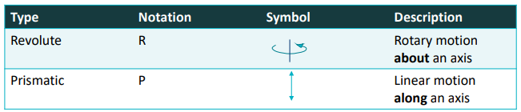

## 1.4 Work Envelop

### 1.4.1 Geometry

- **Major Axes:** First 3 joints of the robot (determines XYZ position of the wrist)
- **Minor Axes:** Remaining joint axes (determines orientation of tool, e.g. roll pitch yaw)
- **Gross Work Envelop:** Locus of points in 3D space that can be reached by the wrist

### 1.4.2 Types

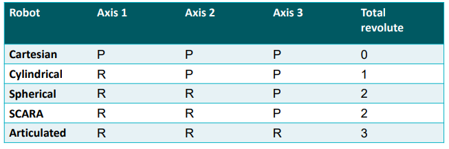
| Type        | Robot         | Work Envelop  |
| ----------- | ------------- | ------------- |
| Cartesian   | 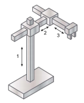  | 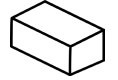  |
| Cylindrical | 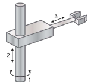  | 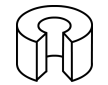  |
| Spherical   | 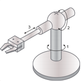  | 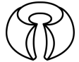  |
| SCARA       | 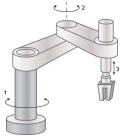  | 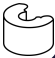 |
| Articulated | 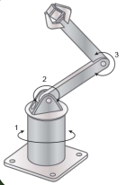 | 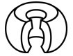   |

# 2 Motion Control Methods

They are various ways to control a robot's motion. They are split into two main categories:

- **Point-to-Point:** Tool move to sequence of discrete points (path not specified)
  - e.g. spot welding / pick-and-place / loading unloading
- **Continuous / Controlled Path Motion:** Tool follows prescribed path in 3D space (may have varying speed)
  - e.g. spray painting / arc welding / gluing

# 3 Robot Specifications

- Number of axes
- Load carrying capacity (kg)
- Maxspeed, cycle time: time to perform certain action (mm / sec)
- Reach (max radial distance), stroke (actual readial distance covered by wrist, not start from center) (mm)
- Tool orientation (deg)
- Repeatability (mm)
- Precision and acuuracy (mm)
- Operating environment

# 4 Tool Orientation

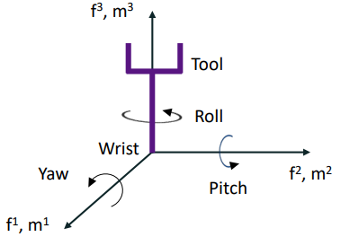

- Yaw (left-right)
- Pitch (head up / down)
- Roll (roll about body axis)

# 5 Repeatability, Precision, Accuracy

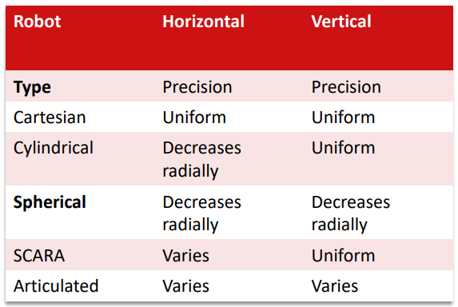

- **Repeatability:** Measure of ability of robot to position tool tip in same place repeatedly
- **Precision:** Measure of spatial resolution with which the tool can be positioned within work envelope
- **Accuracy:** Ability of robot to place tool tip at arbitrary prescribed location in work envelop (error > precision / 2)
