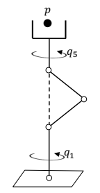
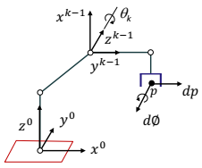

# 1 Tool-Configuration Jacobian Matrix

- tool-configuration vector: $x=w(q)$ for $x \in \mathbb{R}^6$
- given desired trajectory $x(t)$, we can either solve for $q(t)$ using the inverse kinematics (closed-form)
- alternatively, use the tool-configuration Jacobian matrix
  - $\dot{x} = V(q)\dot{q}$ where $V\_{kj}(q)=\frac{\partial w\_k(q)}{\partial q_j}, 1 \le k \le 6, i\ \le j \le n$
  - at each $q$, $V(q)$ is a linear transformation from instantaneous joint-space velocity to instantatneous tool-configuration velocity

## 1.1 Four-Axis SCARA Robot

$$ V(q) = \begin{bmatrix} -a_1S_1 - a_2S_{1-2} & a_2S_{1-2} & 0 & 0 \\\ a_1C_1 + a_2C_{1-2} & -a_2C_{1-2} & 0 & 0 \\\ 0 & 0 & -1 & 0 \\\ 0 & 0 & 0 & 0 \\\ 0 & 0 & 0 & 0 \\\ 0 & 0 & 0 & -[exp(\frac{q_4}{\pi})]/ \pi\end{bmatrix}$$

# 2 Joint-Space Singularities

- Let $V(q)$ be the $6 \times n$ tool-configuration Jacobian matrix of a robotic arm. Then $q$ is a joint-space singularity of the arm if and only if
  - $rank[V(q)] < min \{6,n\}$
- for most common case, $n \le 6$, the tool Jacobian matrix is less than full rank if an only if the $n \times n$ matrix $V^T(q)V(q)$ is singular
- measure of manipulator dexterity (since robot arms are difficult to control when near joint-space singularities)
  - $dex(q) = det[V^T(q)V(q)]$
- in redundant case $n > 6$
  - $dex(q) = det[V(q)V^T(q)]$
- Types
  - boundary singularity: when tool tip is on surface of work envelope
  - interior singularity

## 2.1 Boundary Singularities

for 4-axis scara robot

- $V(q)$ loses full rank if and only if $2 \times 2$ submatrix in the upper left corner becomes singular, determinant of which is
  - $\Delta = a\_1a\_2S_2$
  - singular if and only if $S\_2=0$, means $q\_2=k\pi$

## 2.2 Interior Singularities

- $q(\beta) = [q\_1, -\beta, 2\beta - \pi, -\beta, q\_5]^T, 0<\beta<\frac{\pi}{2}$
- suppose $a\_3= a\_2$ and $a_4=0$
- $v^1[q(\beta)]=0$, $V(q)$ loses full rank along the line $q=q(\beta)$ for $0<\beta<\frac{\pi}{2}$
- e.g. when two or more axes of robot form a straight line

# 3 Generalised Inverses

- Let $A$ be an $m \times n$ matrix. Then an $n \times m$ matrix $X$ is a generalised inverse of $A$ if and only if it satisfies at least property 1 or 2
  - $AXA=A$
  - $XAX=X$
  - $(AX)^T=AX$
  - $(XA)^T=XA$
- Most well-known generalised inverse of $A$ is the Moore-Penrose inverse $A^+$ (reduces to $A^{-1}$ whenever $A$ is non-singular but always exists and is unique)
  - If $A$ is of full rank
    - $m \le n$: $A^T[AA^T]^{-1}$
    - $m=n$: $a^{-1}$
    - $m \ge n$: $[A^TA]^{-1}A^T$
  - $A^{-1}$ gives least-square solution to $Ax=b$ if $m>n$

# 4 Resolved-motion Rate control

- $n \le 6$
  - assume $x(t)$ is differentiable and does not go through any workspace singularities
  - $\dot{q} = [V^T(q)V(q)]^{-1}V^T(q)\dot{x}, q(0) = w^{-1}(x(0))$
- $n=6$
  - $\dot{q}=V(q)^{-1}\dot{x}, q(0)=w^{-1}(x(0))$

# 5 Manipulator Jacobian

A more traditional formulation of the Jacobian (not tool-configuration Jacobian)

- Let $dp \in \mathbb{R}^3$ represent an infinitesimal translation of the tool tip expressed in base coordinates
- Let $d\phi \in \mathbb{R}^3$ represent an infinitesimal rotation of the tool expressed in base coordinates
- infinitesimal displacement vector $du=\begin{bmatrix} dp \\\ d\phi \end{bmatrix}$
- $du = J(q) dq$ at each point $q \in \mathbb{R}^n$

## 5.1 Deriving Manipulator Jacobian

- Let $J(q) = \begin{bmatrix} A(q) \\\ B(q) \end{bmatrix}$
- $A(q)$
  - $dp = A(q)dq$
  - $\dot{p} = A(q)\dot{q}$
  - $A(q)=[dp(q)/dq], A\_{kj}(q)=dp\_k(q)/dq_j$
- $B(q)$
  - $d\phi=B(q)dq = \sum\_{k=1}^n(dq\_k)b^k(q)$
  - joint k is prismatic
    - $b^k(q)=0$
  - joint k is revolute
    - $b^k(q) = z^{k-1}(q)$
  - joint parameter $\xi_k$ (1 if revolute, 0 if prismatic)
    - $b^k(q) = \xi_kz^{k-1}(q)$
    - $z^{k-1}(q) = R_0^{k-1}(q)i^3$

## 5.2 Calculating Manipulator Jacobian

- Set $T_0^0 = I, k=1$
- Compute $b^k(q) = \xi\_k R\_0^{k-1}(q)i^3$
- User property to compute $T\_0^k(q)=T\_0^{k-1}(q) \times T_{k-1}^k(q)$
- Set $k=k+1$, repeat or continue
- Compute $p(q) = H\_1T\_0^n(q)i^4$ and $a^k$
- Form $J(q)$ using previous equation

## 5.3 Four-Axis SCARA Robot

- $b^1(q) = i^3$
- $T\_0^1 = \begin{bmatrix} C\_1 & S\_1 & 0 & a\_1C\_1 \\\ S\_1& -C\_1 & 0 & a\_1S\_1 \\\ 0 & 0 & -1 & d\_1 \\\ 0 & 0 & 0 & 1 \end{bmatrix}$
- $b^2(q) = R_0^1(q)i^3 = -i^3$
- $T\_0^2= \begin{bmatrix} C\_{1-2} & S\_{1-2} & 0 & a\_1C\_1 + a\_2C\_{1-2} \\\ S\_{1-2}& -C\_{1-2} & 0 & a\_1S\_1 + a\_2S\_{1-2} \\\ 0 & 0 & -1 & d\_1 \\\ 0 & 0 & 0 & 1 \end{bmatrix}$
- $b^3(q)=0$ beause third joint is prismatic
- $T\_0^3= \begin{bmatrix} C\_{1-2} & S\_{1-2} & 0 & a\_1C\_1 + a\_2C\_{1-2} \\\ S\_{1-2}& -C\_{1-2} & 0 & a\_1S\_1 + a\_2S\_{1-2} \\\ 0 & 0 & -1 & d\_1 - q_3 \\\ 0 & 0 & 0 & 1 \end{bmatrix}$
- $b^4(q) = R_0^3(q)i^3=-i^3$
- $T\_0^4= \begin{bmatrix} C\_{1-2-4} & S\_{1-2-4} & 0 & a\_1C\_1 + a\_2C\_{1-2} \\\ S\_{1-2-4}& -C\_{1-2-4} & 0 & a\_1S\_1 + a\_2S\_{1-2} \\\ 0 & 0 & -1 & d\_1 -q\_3 - d\_4 \\\ 0 & 0 & 0 & 1 \end{bmatrix}$
- $p(q) = H\_1T\_0^4i^4 = [a\_1C\_1 + a\_2C\_{1-2}, a\_1S\_1 + a\_2S\_{1-2}, d\_1 - q\_3 - d_4]^T$
- $A(q) = \begin{bmatrix} -a\_1S\_1 - a\_2S\_{1-2} & a\_2S\_{1-2} & 0 & 0 \\\ a\_1C\_1 + a\_2C\_{1-2} & -a\_2C\_{1-2} & 0 & 0 \\\ 0 & 0 & -1 & 0 \end{bmatrix}$
- $J(q) = \begin{bmatrix} -a\_1S\_1 - a\_2S\_{1-2} & a\_2S\_{1-2} & 0 & 0 \\\ a\_1C\_1 + a\_2C\_{1-2} & -a\_2C\_{1-2} & 0 & 0 \\\ 0 & 0 & -1 & 0 \\\ 0 & 0 & 0 & 0 \\\ 0 & 0 & 0 & 0 \\\ 1 & -1 & 0 & -1 \end{bmatrix}$

# 6 Induced Joint Torques and Forces

- Both manipulator $J(q)$ and tool-configuration $V(q)$ Jacobians can be used for resolved-motion rate control, but $J(q)$ can also be used to relate external forces and moments applied at the end of the arm to internal torques and forces induced at the joints
- Let $F^{tool} \in \mathbb{R}^6$ denote vector of external forces ($f$) and moments ($n$) applied at the tool tip
  - $F^{tool} = \begin{bmatrix} f^{tool} \\\ n^{tool} \end{bmatrix}$
- Let $\tau \in \mathbb{R}^n$ denote the vector of joint torques and forces
  - if joint k is revolute, $\tau_k$ is torque about axis $k$ produced by actuator
  - if joint k is prismatic, $\tau_k$ is force along axis $k$ produced by actuator
- Equivalent Joint Torques and Forces (assume frictionless joints)
  - $\tau = J^T(q)F^{tool}$
- Remember the analysis is done under static equilibrium

# 7 Tool Compliance and Stiffness

- Joint drive system constitutes a major source of tool displacement
- Each joint controller will produce a restoring torque or force whenever there is an error between desired position of the link and the measured position
- For small join displacements $\Delta q$, relationship between the displacement and restoring torque or force $\Delta \tau$ can be modelled as $\Delta \tau\_k = \gamma\_k \Delta q_k$
- Here $\gamma_k>0$ can be thought of as a spring constant for joint $k$
- Joint stiffness matrix $\Gamma = diag\{\gamma\_1,...,\gamma\_n\}$
- Infinitesimal tool deflection $\Delta u = J(q) \Gamma^{-1} J^T(q)F^{Tool}$
- Compliance matrix $G(q) = J(q) \Gamma^{-1} J^T(q)$ (invertible if $q$ is not singularity point)
- Tool stiffness matrix $G^{-1}(q)$
- Tool stiffness matrix has large components near joint-space singularity
