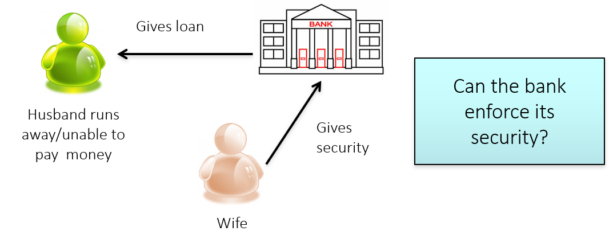

# 1 Overview

So far, we have covered contract formation, terms, discharge and remedies. Next, we will be going backwards and investigate the vitiating factors that can void a contract. Vitiating factors are basically things that change or destroy the basis upon which the contract was formed, and hence render the contract void / voidable (the subtleties will be explained).

Vitiating factors that is covered in class includes:

- Mistake
- Misrepresentation
- Duress
- Illegality
- Undue Influence

# 2 Mistake

## 2.1 Common Law vs Equity

Equity is a branch of law that is different from common law. While both equity and common law are judge-made law, equity serves to fill some gaps in common law and uphold certain moral principles.

**Mistake at Common Law**

An operative mistake at **common law** will render the contract _**void ab initio**_ (i.e. deemed invalid from outset and seek to revert to the state before the contract was formed). In the case of a purchase, the buyer has no rights to pass the item to third party and seller can regain ownership of the object.

**Mistake in Equity**

An operative mistake in **equity** will render the contract **voidable**. All rights and obligations under the contract continue to exist until the mistaken party rescinds the contract. In the case of a purchase, the buyer has rights to pass the item to third party and ownership will remain with the third party if the transaction occurs before the seller chooses to terminate the contract.

## 2.2 Mutual Mistake

A mutual mistake arises where there is a **complete lack of coincidence between offer and acceptance** between the parties.

**General Rule:** The doctrine of mutual mistake **overlaps completely … with the doctrine of offer and acceptance**, dealing with the issue of the formation of a pre-existing transaction as opposed to a mistaken payment _simplicter_ … Put simply, this particular aspect of the law relating to mistake is simply the result of a lack of coincidence between offer and acceptance. In other words, both parties are at cross-purposes and, hence, no agreement or contract has been formed as a result. - _Wellmix Organics (International) Pte Ltd v Lau Yu Man_ (2006)



- **Context:** The contract for stated that the cargo of cotton was to arrive in Liverpool on the ship "Peerless from Bombay". The term "Peerless" was capable of applying equally to a cargo of cotton on two different ships, each called "Peerless" and each having sailed from Bombay, one in October and one in December. The court could not determine which ship the parties were referring to in the contract.
- **Holding:** There is mutual mistake.





- **Context:** Had one party intended the October shipment and the other the December shipment, the agreement necessary for a binding contract would have been absent.
- **Holding:** There is mutual mistake.



## 2.3 Common Mistake

### 2.3.1 Common Mistake at Common Law

**General Principles (not important)**

- The law seeks to uphold rather than destroy contracts - _Associated Japanese Bank (International) Ltd v Credit du Nord SA_ (1989)
- The doctrine of mistake caters only to "unexpected and wholly exceptional circumstances" - _Associated Japanese Bank (International) Ltd v Credit du Nord SA_ (1989)

The essence to identifying a common mistake is the three requirements listed below. It should be noted that the threshold for **"fundamentally different"** is extremely high based on the given cases. It might even be appropriate to claim that a simply change in quantity or quality is usually insufficient. Additionally, it should be noted that, unlike discharge by frustration, requirement 1 states that the mistake is related to **facts before the contract was concluded**.

**Requirements**



- First, the mistake must be **shared by both parties** and relate to facts or law **before the contract was concluded**.
- Secondly, the mistake must render the subject matter of the contract **fundamentally different** from the subject matter which the parties contracted on as constituting the basis of their contract.
- However, there must have been **no allocation of risk to either party** of the consequences occasioned by the mistake. The mistake concerned must also **not be attributable to the fault of either party**.





- **Context:** The Commission invited tenders for a wrecked tanker that was said to contain oil. McRae tendered and the Commission accepted. McRae embarked on costly salvage expedition. The Tanker turned out to not exist, and McRae sued for breach of contract. The Commission tried to argue that the contract was void for common mistake (as to the tanker’s existence).
- **Holding:** There was no common mistake, as the Commission had assumed the risk relating to existence of tanker; the court Inferred from the correspondence between the parties that the commission had promised that there was a tanker. -"Tenders are invited for the purchase of an OIL TANKER lying on JOURMAUND REEF, which is approximately 100 miles NORTH OF SAMARAI. THE VESSEL IS SAID TO CONTAIN OIL. OFFERS TO PURCHASE THE VESSEL AND ITS CONTENTS".





- **Context:** Bell and Snelling were hired to be the chairman and vice-chairman of a subsidiary. They were let go due to corporate restructuring, but paid bonuses for their early termination. It then transpired that they breached their contracts (by moonlighting) while still employed by LBL. LBL then claimed against Bell and Snelling for the bonuses on the ground of mistake (that the parties did not know that the contracts were voidable for Bell and Snelling’s breach earlier).
- **Holding:** No money could be recovered. The mistake was not fundamental enough as to render the contract essentially different from what the parties had contemplated. **A mistake as to the quality of the thing will only affect the validity of the contract if it makes the thing without the quality radically and essentially different from the thing it was believed to be**.





- **Context:** TS agreed to provide salvage services for a vessel in serious difficulties in the Pacific Ocean. They were informed that The Great Peace was close to the vessel so they contacted the owners of The Great Peace to hire it for 5 days. Later, they found out that The Great Peace was not as close to the vessel in danger (it was 410 miles away rather than 35 miles). TS then tried to hire another nearer vessel and they tried to void the contract for The Great Peace.
- **Holding:** The mistake was not sufficient to vitiate the contract. Although the vessels were 410 miles apart and it would have taken 22 hours for the vessels to meet, this was not a time delay to result in a performance "essentially different from what the parties envisaged when the contract was concluded". A common mistake arises only if the parties had agreed to something **which was impossible to perform**.



### 2.3.2 Common Mistake in Equity

**English Law:** The doctrine of common mistake in equity appears to have been abolished under English law - _Great Peace Shipping Ltd v Tsavliris Salvage (International) Ltd_ (2002)

**Singapore Law:** The doctrine in equity exists as part of Singapore law - _Olivine Capital Pte Ltd v Chia Chin Yan_ (2014)

**General Rule:** The requirements for common mistake in equity are essentially the same as the requirements for common mistake at common law, **except that the threshold of "fundamental" is a lower one** (_ie_, it will be easier to find a common mistake in equity than at common law) - _The Law of Contract in Singapore_

## 2.4 Unilateral Mistake

### 2.4.1 Unilateral Mistake at Common Law

**General Rule:** "… as a general rule, a party to a contract is bound even though he may have made a mistake in entering into the contract. The law looks at the objective facts to determine whether a contract has come into being. The real motive or intention of the parties is irrelevant" - _Chwee Kin Keong v Digilandmall.com Pte Ltd_ (2005)

**Exception:** "However, there is an exception to this rule when the offeree knows that the offeror does not intend the terms of the offer to be the natural meaning of the words" - _Chwee Kin Keong v Digilandmall.com Pte Ltd_ (2005)



- **Context:** The plaintiff contracted to buy hare skins from the defendant. The defendant mistakenly sold at a **price per pound** when they had intended to sell the skin at a **price per piece**. The plaintiff **was aware** of the mistake. The defendant refused to deliver the goods and the plaintiff sued.
- **Holding:** There was a unilateral mistake by the defendant.



**Requirements**



- First, one party has made a mistake
- Secondly, the mistake is a sufficiently important or **fundamental mistake as to a term of the contract**
- Thirdly, the non-mistaken party must have had **actual knowledge** of the mistake

**What is a fundamental mistake?**

- There is no doubt that the error in the present case as to the price is a fundamental one
  - An accidental omission of a key clause from a contract may constitute a fundamental mistake

**What is actual knowledge?**

- In order to enable the court to come to the conclusion that the non-mistaken party had actual knowledge of the mistake, the court would go through a process of reasoning where **it may consider what a reasonable person, placed in the similar situation, would have known** … Clearly, if the court finds that the non-mistaken party is guilty of wilful blindness, it will be in line with logic and reason to hold that that party had actual knowledge



### 2.4.2 Unilateral Mistake in Equity

**Requirements**



- First, one party has made a mistake
- Secondly, the mistake is a sufficiently important or **fundamental mistake as to a term of the contract**
- Thirdly, the non-mistaken party must have had **actual OR constructive knowledge** of the mistake
- Fourthly, the non-mistaken party must have had engaged in **sharp practice** or **unconscionable conduct**

**What is constructive knowledge?**

- where the non-mistaken party did not have actual knowledge of the error but **ought to have known about the other party’s mistake**

**What is impropriety?**

- Mere negligence is **not** impropriety
  - The conduct of deliberately not bringing the suspicion of a possible mistake to the attention of the mistaken party could constitute such impropriety
  - **Facts of the case** - The second appellant had made extensive search over the Internet and found that other websites were offering the same printer at about $3000. He had admitted doubting the price on the respondent’s website and even wondered if he was only buying parts. He was **shutting his eyes to the truth and snapping up a bargain even when he doubted its correctness**. - The 4th appellant was concerned with the very low price of $66 since colour laser printers were among the most expensive in the world. He searched Internet and found that they usually sold for US $2000. He tried to seek confirmation with the respondent via telephone but nobody picked up. - He suspected that there was a mistake; the reasonable thing to do was to wait until the morning to ascertain the truth of the offer before ordering. He proceeded to make purchases as if he was scared that his belief that there was a mistake would be confirmed. The act of verification confirmed that he had harboured doubts about the correctness of the price.



## 2.5 Unilateral Mistake as to Identity

**Classic Scenario**

- A is the seller of a good
- B is a fraudster who assumes the identity of C, inducing A into contracting with B for the sale of the good
- A sells the good to B, thinking that B is actually C
- D, an innocent third party, then purchases the item from B
- B absconds without paying A for the item
- A is left with no choice but to recover the item from D
- A will argue that there was a unilateral mistake as to identity, and that his contract with B is void
- If A’s contract with B is void, B had no right to sell the item to D
- D would thus have to return the item to A

**Categories**

- where the parties are face-to-face (_inter praesentes_)
- where the parties are contracting at a distance (non- _interpraesentes_)

### 2.5.1 Inter Praesentes Cases

**General Presumption:** Presumption that A intended to deal with the person in standing in front of him (_ie_, B).

- **English Law:** The presumption in _inter praesentes_ cases has been criticised as being unprincipled and unfair. However, it remains very much a part of English law as it stands today
- **Singapore Law:** "… it is arguable that the presumption in _inter praesentes_cases apparently applies in Singapore" - \_The Law of Contract in Singapore_

**Exception:** This presumption can theoretically be rebutted if A can show that he intended to contract with C only, but case law suggests that this is an extremely difficult presumption to rebut.



- **Context:** A rogue represented himself to a car dealer as "Mr Durlabh Patel". The rogue produced a genuine driving license (which the rogue had unlawfully procured), which the car dealer then faxed to Shogan Finance. Shogun Finance conducted a credit check on Mr Durlabh Patel, and subsequently entered into a car hire-purchase agreement with the rogue. The rogue then sold the car to Mr Hudson (who was unaware that the vehicle belonged to Shogun Finance and was subject to a hire-purchase agreement) before absconding. Shogan Finance then brought an action against Mr Hudson seeking the return of the car.
- **Holding (Majority):** There **was** a unilateral mistake as to identity. This was a **non-**interpraesentes** situation**; the car hire-purchase agreement was concluded between Shogan Finance and the rogue, and NOT between the car dealer and the rogue. There was thus no presumption that Shogan Finance intended to contract with the rogue. Objectively, Shogan Finance intended to transact with Mr Durlabh Patel, and not the rogue. This was clear from the terms of the written car hire-purchase agreement (which listed Mr Durlabh Patel as a party), and the fact that Shogan Finance had carried out a credit check on Mr Durlabh Patel.

**Important Obiter** **(although this is a non-**interpraesentes** case, this obiter is so important that it can be applied to **interpraesentes** case**s)

- Lord Nicholls (dissenting): "**it is not easy to think of practical circumstances** where, once in point, the presumption will be displaced"
- Lord Millett (dissenting): "But there is surely nothing to be said for resorting to a rebuttable presumption in order to resolve a question of fact which is incapable of being determined by evidence. If there is no test by which the question can be answered on the evidence, **there is none by which the Court can determine whether the presumption has been rebutted**"
- Lord Phillips (majority): there is "**a strong presumption** that each intends to contract with the other" in **inter praesentes** cases
- Lord Walker (majority): "If the principle is no more than a presumption, it is a strong presumption, and **exceptions to it would be rare**"



### 2.5.2 Non-inter Praesentes Cases

**General Rule:** No Presumptions. The facts of the case will be examined objectively to determine who A objectively intended to contract with.

- **Singapore Law:** For non- _inter praesentes_ cases, the question should be focused on who the non-mistaken party objectively intended to contract with -_The Law of Contract in Singapore_

## 2.6 Non est Factum

i.e. "This is not my deed"



- "Traditionally, the doctrine is only of significance in contexts where a mistakenly signed document has been relied on by unsuspecting third parties. A classic example would be where A misleads B to sign a document, which A then uses to obtain an advantage from C. In a suit between B and C, the question would arise as to whether B may disown his signature on the ground of **non est factum**"





- The doctrine was designed to protect &#8216;those who are permanently or temporarily unable, through no fault of their own, to have without explanation any real understanding of the purport of a particular document. This was a narrow class of persons who are typically unable to read owing to blindness or illiteracy and who therefore had to trust someone to tell them what they were signing'



**Requirements**



- First, there must be a radical difference between what was signed and what was thought to have been signed - Secondly, the party seeking to rely upon the doctrine must prove that he took care in signing the document, that is, he must not have been negligent.



# 3 Misrepresentation

## 3.1 Overview

### 3.1.1 What is misrepresentation?

**Misrepresentation:** A false statement of fact made by one party to another, which induces the party to enter into the contract.

### 3.1.2 Consequence of misrepresentation

If the court finds that there is misrepresentation, the contract becomes voidable.

### 3.1.3 When can one sue for misrepresentation?

Where the misrepresentation has become a term of the contract, misrepresentation will still be actionable - _Section 1(a) Misrepresentation Act_ (the innocent party can sue for breach of contract or for misrepresentation, depending on what remedy he is seeking)

Misrepresentation can still be alleged where the contract has been performed - _Section 1(b) Misrepresentation Act_

### 3.1.4 Elements of misrepresentation

1. There must have been a false representation of fact
2. The false representation must have been addressed to the other party
3. The other party must have been induced by the misrepresentation into entering the contract

## 3.2 Element 1

### 3.2.1 Statement of fact vs statement of law

**General Rule:** Traditional position used to be that false statement of law is not an actionable misrepresentation, only false statement of facts are actionable

**Exception:** _Pankhania v Hackney LBC_(2002) suggests that a false statement of law may be considered an actionable misrepresentation

### 3.2.2 Representations vs puffs

**General Rule:** To be a representation, a statement must relate to a matter of present or past fact - _Bestland Devt Pte Ltd v Thasin Devt Pte Ltd_ (1991)

**General Rule:** Commendation by a salesman of the goods that he sells is a common and expected feature of the marketplace and likely puffs - _Tan Chin Seng v Raffles Town Club_ (2002)

### 3.2.3 Are opinions representations?

**General Rule:** No misrepresentation if it is a statement of opinion which the party honestly hold*.*



- **Context:** A vendor of a farm in New Zealand, which had not been used for sheep farming before, told a prospective purchaser that, in his judgement, the land could carry 2,000 sheep. When the purchaser discovered that it could not, he sought to set aside the contract for misrepresentation.
- **Holding:** There was no misrepresentation because the vendor’s statement was not a false statement of fact but a statement of opinion which he honestly held.



**General Rule:** Opinion can be making implied representation on certain facts



- **Context:** Mardon wanted to lease a filling station from Esso which was still being constructed, the plans of which were significantly altered to satisfy the local authorities. Esso’s experienced representatives assured Mardon that this change would not affect the petrol sales, which would reach 200,000 gallons per year. In fact, despite Mardon’s best efforts, it achieved only 78,000 gallons per year. Mardon claimed against Esso for misrepresentation. The issue was whether the statement was opinion or fact.
- **Holding:** The opinion here was making implied representation on certain facts.
- **Holding:** In **Bisset**, the land in question had never been used as a sheep farm and both parties were equally able to form opinions as to its carrying capacity. Here, Esso had much more experience and expertise at their disposal and were much more able to make a forecast.<ul>
  - If such a person makes a forecast — intending that the other should act on it and he does act on it — it can be interpreted as a warranty that the forecast is sound and reliable in this sense that they made it with reasonable skill and care.



### 3.2.4 Are statements of intentions representations?

**General Rule:** A person who misrepresents his present intention, even though it may relate to his future conduct, makes a false statement of fact because the state of his intention is a matter of fact.



- **Context:** Directors of a company invited the public to subscribe for debentures (bonds) stating that the money raised would be used to expand the business. In fact, the real purpose in raising the money was to pay off company debts.
- **Holding:** The directors were guilty of misrepresentation because they misrepresented their actual intention. A misrepresentation as to the state of a man's mind is, therefore, a misstatement of fact.



### 3.2.5 Implied representations

**General Rule:** An express statement can contain an implied representation.



- **Context:** A true statement was made that a financial product carried an "AAA" rating. The court held that it contained an implied representation that the product was of low risk.
- **Holding:** The test is whether **a reasonable person** in the position of the representee **would have understood that an implied representation was made**.



**General Rule:** Implied representation can also be found through a person's conduct.



- **Context:** When a person sits down at a restaurant he impliedly represents that he has the ability to pay for the meal. A nod of the head might signify agreement, just as a shake of the head will show disapproval.
- **Holding:** Test is whether the statement is** intended to induce the other party to believe in a certain state of facts**. If yes, the gesture or conduct can amount to a representation.



### 3.2.6 Can silence equate to a representation?

**General Rule:** No. Mere silence does not equate to a representation - _Bradford Third Equitable Benefit Building Society v Borders_ (1941)

**Exceptions**

1. Silence cannot result in half-truths/deceit
2. Where A statement (the representor knows is false) is made by a third party to the representee while the representor listens in silence, his reticence may amount to tacit confirmation of the truth of the statement
3. Silence must not conceal a defect



- **Context:** APS agreed to sponsor the Spice Girls concert tour in return for promotional work carried out by the group. After the contract was signed, one of the members, Ms Geri Halliwell, left the group. It was found out that she had informed the other members of her intention to leave before the contract was signed.
- **Holding:** The nature of the promotional materials sent by Spice Girls Ltd was a misrepresentation that all five members of the group would participate. A contracting party may keep silent, but once he makes a statement, it must be full and frank, and not a half-truth or untruth.





- **Context:** The defendant contracted to sell a public house to Mr Bowmer. He had knowingly made a false misrepresentation to Bowmer regarding the profits earned on the property. Bowmer could not complete the purchase. Bowmer then informed the plaintiff of the representations made by the defendant . The defendant then contracted with the plaintiff directly for the sale of the house. During the negotiations between the plaintiff and defendant , nothing was said about the original representations.
- **Holding:** There was misrepresentation as the defendant did not correct the prior representation. The defendant’s knowledge was crucial in this case as he knew that his representation to Mr Bowmer was passed on to the plaintiff by Mr Bowmer.





- **Context:** To conceal the fact that the bottom of the ship was worm-eaten, the seller removed the ship from a dry dock and kept her afloat until the sale was over.
- **Holding:** "… it appears here that means were taken fraudulently to conceal defect in the ship’s bottom". Active attempt to conceal defects will be taken as a representation that the defect does not exist.



### 3.2.7 Change in circumstances

**General Rule:** Once a representation is made, the representation is generally treated as continuing - _Jones v Dumbrell_ (1981) (i.e. if the facts change to make your representation false, this can still constitute an actionable misrepresentation, because representation is made at the time of contract)

**General Rule:** If the representor discovers that the representation was false when made or has become false since, he should correct it - _Spice Girls Ltd v Aprilia World Service BV_ (2002)



- **Context:** A doctor was seeking to sell his practice. He told a prospective purchaser that the practice's income was £2,000 per annum. This was true at the time, but because the doctor fell sick, the practice declined considerably over the next few months, so that by the time it was actually sold, its value had reduced significantly, and takings were averaging only £5 per week.
- **Holding:** The failure to notify the purchaser of the fact that the earlier statement was no longer true amounted to a misrepresentation.



## 3.3 Element 2

There are three kinds of people who may bring an action for misrepresentation

1. The direct recipient of the representation
2. The principal, if the agent receives the representation
3. An indirect recipient whom the representor intended or reasonably expected the representation to be passed to - _Gross v Lewis Hillman_ (1970)

## 3.4 Element 3

### 3.4.1 What is inducement

**General Rule:** Inducement requires proof that the statement has influenced the representee to change her behaviour in reliance on the representation - _Wee Chiaw Sek Anna v Ng Li-Ann Genevieve_ (2013)

### 3.4.2 What is the degree of inducement required?

**General Rule:** The correct question to ask is whether the representation has had a "**real and substantial effect** on the representee’s mind such that it can be said to be an inducing cause which led him to act as he did; **it need not be the inducing cause**" - _Alwie Handoyo v Tjong Very Sumito_ (2013)

### 3.4.3 Objective or subjective inducement?

**General Rule:** Test is **SUBJECTIVE** (but subjective intention is objectively determined). Hence no inducement where:

- The representee was unaware of the existence of the representation
- The representee knew that the representation was untrue
- The representee does not allow a representation to affect his judgement.



- **Context:** The prospectus of a company in which the representee had bought shares in contained a false statement that Mr Grieve was a director of the company. The representee had no knowledge who Mr Grieve was.
- **Holding:** The representee was not entitled to damages. The representee gave evidence that he had never heard of Mr Grieve before. That proved that the representee was not induced to take the shares by this deceit.



### 3.4.4 Is due diligence required?

**General Rule:** If a man is induced to enter into a contract by a false representation **it is not a sufficient answer to him to say**, "If you had used due diligence you would have found out that the statement was untrue. You had the means afforded you of discovering its falsity, and did not choose to avail yourself of them" - _Redgrave v Hurd_ (1881–82)

**General Rule:** The focus is on whether there was reliance on the statement, whether or not the representee had done his due diligence is irrelevant - _Jurong Town Corporation v Wishing Star_ (2005)

## 3.5 Types of Misrepresentation

There are three types of misrepresentation:

- Fraudulent misrepresentation
- Negligence misrepresentation
- Innocent misrepresentation

All three types have the three elements of misrepresentation but the difference lies in the state of mind of the representor.

## 3.6 Fraudulent Misrepresentation

### 3.6.1 Threshold

"It is, in our view, of the first importance to emphasise right at the outset **the relatively high standard of proof which must be satisfied** by the representee before a fraudulent misrepresentation can be established successfully against the representor" - _Wee Chiaw Sek Anna v Ng Li-Ann Genevieve_ (2013)

### 3.6.2 Requirements



1. There must have been a false representation of fact
2. The representation was made with the intention that it should be acted on by the representee

- Whether the representor intended to induce the representee to act on the representation must be determined subjectively -*Wee Chiaw Sek Anna v Ng Li-Ann Genevieve* (2013)

1. The representee acted upon the false statement
   - If the false statement does not influence or lead the representee to change his behaviour in reliance of the misrepresentation, there is no inducement -*Wee Chiaw Sek Anna v Ng Li-Ann Genevieve* (2013)
2. The representee suffered damage by so doing
3. The representation was wilfully made with the knowledge that it was false, or at least made in the absence of any genuine belief that it was true

- Dishonesty must be determined subjectively (from the perspective of the representor) - *Wee Chiaw Sek Anna v Ng Li-Ann Genevieve* (2013)
- If the representor honestly believed in what he or she was representing, there can be no fraudulent misrepresentation



## 3.7 Negligent Misrepresentation

### 3.7.1 Ways to argue for negligent misrepresentation

1. Sue under tort of negligence for negligent misstatement
2. Rely on _Section 2(1) Misrepresentation Act_
   - Once an actionable misrepresentation has been established, it is considered a negligent misrepresentation unless the representor proves that he had reasonable grounds to believe that it was true

## 3.8 Innocent Misrepresentation

A misrepresentation that is neither fraudulent nor negligent.

## 3.9 Remedies for Misrepresentation

- All successful claims of misrepresentation give the innocent party the remedy of rescission (the contract becomes voidable) ➜ innocent party must elect to affirm the contract or to rescind the contract. Party who chooses to rescind the contract must notify the representor
- However, remedy of damages depend on the type of misrepresentation

### 3.9.1 Recission

- Once the contract is rescinded, there would _restitutio ad integrum_ (parties would have to restore back any benefits received), not precise but substantial restitution
- A representee can rescind if he returns the subject matter in its altered state and makes allowance for diminution in its value, if this is not possible, the representee is notbarred from rescinding if the diminution is due to the very defect which was misrepresented
- Where substantial restitution is impossible, the representee will be barred from rescinding the contract
- A representee will also be barred from rescinding a contract where a third party has acquired a right in the property in question before rescission

**For negligent and innocent misrepresentation**

- An unreasonable lapse of time will also be a bar to rescission - _Leaf v International Galleries_ (1950)
- The court may award damages in lieu of rescission at its discretion, depending on the facts of the case / the nature of the contract - _Section 2(2) Misrepresentation Act_

### 3.9.2 Damages under fraudulent misrepresentation

"… an award of damages for fraudulent misrepresentation covers a wide ambit – including **all loss which flowed directly as a result of the entry by the representee into the transaction in question**, **regardless of whether or not such loss was foreseeable**, and which would include all consequential loss as well" - _Wee Chiaw Sek Anna v Ng Li-Ann Genevieve_ (2013)

### 3.9.3 Damages under negligent misrepresentation

**English Law**

- Damages for negligent misrepresentation would be the same as damages for fradulent misrepresentation - _Section 2(1) Misrepresentation Act_, _Royscot Trust v Rogerson_ (1991)

**Singapore Law**

- Damages should be that awarded under the tort of negligence (subject to remoteness) - _RBC Properties Pte Ltd v Defu Furniture Pte Ltd_ (2015)
- Damages claimed under fraudulent misrepresentation is NOT subject to such limitation

### 3.9.4 Damages under innocent misrepresentation

- Representee is not entitled to damages
- The court may exercise its discretion under _Section 2(2) Misrepresentation Act_ to award damages in lieu of rescission

## 3.10 Exclusion of Liability for Misrepresentation

The test of "reasonableness" in Section 11(1) of the UCTA applies to any clause seeking to exclude or restrict - _Section 3 Misrepresentation Act_:

- any liability to which a party to a contract may be subject by reason of any misrepresentation made by him before the contract was made
- any remedy available to another party to the contract by reason of such a misrepresentation

However, it has been suggested that any attempt to exclude liability for fraudulent misrepresentation can never be reasonable - _Thomas Witter Ltd v TBP Industries_ (1996)

# 4 Duress

## 4.1 What is duress?

**Duress:** Exertion of illegitimate pressure which forces a person to enter into a contract. "Forces" suggest a causation requirement, but the strictness of the causation requirement depends on the type of illegitimate pressure. If duress is found, contract becomes **voidable**.

## 4.2 Elements of Duress



- The exertion of illegitimate pressure - Such pressure amounting to the compulsion of the victim’s will - Causal link between the pressure and the conclusion of the contract
- The more illegitimate the pressure, the lower the causal threshold



## 4.3 Types of Duress

- Duress to the person
- Duress of goods
- Economic duress

## 4.4 Duress to the Person

### 4.4.1 What is duress to the person?

Threats of physical harm to a person’s body. The threat can be directed to the other contracting party or to a third person.

- Sign the contract or I will kill you: _Barton v Armstrong_ (1976)
- Sign the contract or I will kill your XXX

### 4.4.2 How to prove?

For duress to the person, to show the causal link, it need only be proved that the threat was **one reason** why the contract was entered into. - _Tjong Very Sumito v Chan Sing En_ (2012)

## 4.5 Duress of Goods

### 4.5.1 What is duress of goods?

Threat to destroy or damage property or threats to seize or detain goods **unlawfully**.

### 4.5.2 How to prove?

For duress of goods, to show the causal link, the law applies a "but for" standard which commentators have described as "easily met" - _Tan Zhong Xing, "Equity and Opportunism in the Law of Contract: A Case Study in Fusion by Diffusion"_ (2018)



- **Context:** The plaintiff pawned a plate to the defendant for £20. Three years later the defendant refused to allow the plaintiff to redeem the plate unless the plaintiff paid the defendant interest of £10. The plaintiff tendered £4, but the defendant refused. The plaintiff eventually paid £10 to get his plate back.
- **Holding:** The plaintiff was entitled to recover the extra money paid up. There was illegitimate pressure in the form of a threat to deprive property lawfully belonging to the plaintiff.



## 4.6 Economic Duress

### 4.6.1 What is economic duress?

Arises where a party uses **superior "economic" power** in an **illegitimate** way to coerce the other to agree to some terms. Note that economic duress only arises in **very exceptional situations** - _Eastern Resource Management Services Ltd v Chiu Teng Construction Co Pte Ltd_ (2016). Because it is difficult to sift out **economic duress** from **commercial pressure**.

### 4.6.2 Minimum Requirement

- Satisfy the "but for" test - _Tjong Very Sumito v Chan Sing En_ (2012)
  - Often the requirement is that the pressure must be "**decisive or clinching**", and further that the claimant had "**no practicable alternative**" to but accede to the demand - _Tan Zhong Xing, "Equity and Opportunism in the Law of Contract: A Case Study in Fusion by Diffusion"_(2018)

### 4.6.3 Prove by Illegitimate Pressure

**General Rule:**

- unlawful threat ➜ illegitimate pressure
- lawful thread used to support an unreasonable demand ➜ may constitute illegitimate pressure



- **Holding (Lord Hoffmann):** "Generally speaking, the threat of any form of unlawful action will be regarded as illegitimate. On the other hand, if the threat is lawful, it is not necessarily legitimate."



**Unique Situation (a threat to breach a contract, i.e. unlawful):** test is whether the threat to breach the contract in order to support a certain demand, taken as a whole, is reasonable - _The Law of Contract in Singapore_ (2012)

- Bad faith plays a critical role in deciding whether a threatened breach of contract is illegitimate - _The Law of Restitution_ (2002)
  - illegitimate if concerned to exploit the claimant's weakness rather than solving the defendant's financial / other problems
  - threat should not be considered _mala fide_ (made in bad faith) if it is a reaction to unforeseen and highly adverse circumstances / just correcting what was a clearly bad bargain
- Other factors - _DSND Subsea Ltd v Petroleum Geo Services ASA_ (2000)

  - actual / threatened breach
  - whether person was acting in good faith
  - whether there was any realistic practical alternative
  - whether the person affirmed or relied on the contract



- **Context:** The plaintiff was a small Singapore company without significant record or assets. The plaintiff agreed to sell steel products to defendant who would then on-sell them. The plaintiff had to secure a ship for the shipment of the products to Korea, but due to its inexperience, was unable to secure a vessel at the rate agreed on. It found another ship at a much higher rate and told the defendant that "unless the defendant shared the increased costs, the plaintiff was prepared to terminate the contract". The defendant agreed since it had to meet the deadline set by its customers.
- **Holding:** There was no economic duress. A threat to breach a contract, absent bad faith, should not be an illegitimate threat, although sometimes they can be presumed to be unconscionable. On the facts, the spirit and cooperative nature of the venture and the plaintiff’s inexperience resulted in the underestimation of the shipping cost. The plaintiff was not seeking to exploit the situation to increase his profits. <ul>
  - The absence of bad faith was clearly a factor; the plaintiff was merely informing the other party that it was unable to perform the contract rather than attempting to exploit the other party





- **Context:** The plaintiff and defendant were doctors and business partners. They had set up several clinics together and held equal shares. The defendant suspected that the plaintiff was having an affair with staff. The plaintiff denied it but the defendant later found evidence of it. The defendant gave the plaintiff 3 options, and threatened to wind up the company if the defendant did not comply:
  - The defendant buys out the plaintiff’s half share in the clinics and the plaintiff  takes over some of the clinics’ liabilities - The plaintiff buys out the defendant’s half share in the clinics - The business would be wound up by the courts; evidence of the defendant’s affair would be tendered to the court as evidence
- **Context:** The plaintiff accepted the first option, but later sought to invalidate the agreement for economic duress
- **Holding:** The pressure was illegitimate. The defendant was entitled to take all legal steps to terminate their business relationship and to minimise the loss he would suffer, but he could not take advantage of the situation and unfairly profit from it.
  - The defendant did not have to ask the court to wind up the companies. Both parties could have done so on a voluntary basis; there would be no need to tender evidence of the affair to court as evidence. Thus, the defendant was abusing the legal process.
  - The defendant was also seeking to buy over the plaintiff’s share of the business at an undervalue of 25% of its market value. It was also unreasonable to seek the plaintiff to take over a significant portion of the liabilities.
  - The defendant confronted the plaintiff in a way that was designed to unnerve the plaintiff. The only option that would not have resulted in the evidence of the affair being publicised was the sale of the plaintiff’s shares at a price that was manifestly disadvantageous to him.





- **Holding:** "We are not yet in Utopia and so there remains a distinct and discernible difference between what is ‘illegitimate’ and what is ‘unconscionable’ and it is worth remembering that what is unconscionable is not necessarily illegitimate."
- Courts must be mindful of finding illegitimate pressure just because terms are lawful but "manifestly disadvantageous". To do so would lead to uncertainty in commercial contracts and the bargaining process , and comes too close to rewriting disadvantageous contracts. - Manifest disadvantage may be an indicator, but courts ought to ground the illegitimacy of the pressure on other factors such as evidence of bad faith/exploitation of the party



### 4.6.4 Prove by Coercion of Will



- **General Rule:** Relevant factors for determining that there was coercion of will include
  - Whether the person did or did not protest
  - Whether he had an alternative open to him such as an adequate legal remedy
  - Whether he was independently advised
  - Whether after entering the contract he took steps to avoid it.
  - **Note:** The main factor appears to be whether the alleged victim had a reasonable alternative course open to him -**The Law of Contract in Singapore** (2012)





- **Holding**
  - The plaintiff **did not protest**, but gave the defendant alternatives (which were flatly rejected). The plaintiff  indicated that he was unhappy with the demands and his eventual acceptance was bowing to the demands rather than willing agreement.
  - The defendant gave the plaintiff **no real practical alternative**. The defendant told the plaintiff that he was not in a position to negotiate.
  - There was implicit pressure for the plaintiff to make up his mind immediately (there was **no time for the plaintiff to seek advice**). That the plaintiff did not ask for time indicated that his consent was vitiated and his will overborne. He thought he had no choice but to agree.
  - The plaintiff **brought the current suit in a bit to avoid the contract** that was concluded under coercion of will



# 5 Illegality

## 5.1 Rationale

Mistake and misrepresentation: consent and autonomy of contracting party has been adversely affected.

Illegality: public policy considerations.

In this section, illegality focuses on ROT clauses (other examples include contracts to commit crimes, contracts for "maintenance" or "champerty".

## 5.2 Restraint of Trade Clauses

An ROT clause is essentially one that restraints on the freedom to conduct business. E.g.

- clause that prohibit former employee from working in certain companies or industries related to the former employer (in employment context)
- clause that prohibits the seller of a business from starting a new business in a certain industry related to the buyer (in sale of business context)

Courts scrutinise ROT clauses more closely in employment cases than in sale of business cases

- need to protect goodwill (reputation of a business) on the part of the buyer of the business
- higher likelihood of equality of bargaining power

## 5.3 Two-stage Test



- Is there **legitimate proprietary interest** to be protected?
- Is the clause **reasonable** both as between the parties and in the interests of the public



**General Rule:** ROT clauses are void unless they are reasonable.

## 5.4 Legitimate Proprietary Interest

Examples:

- **Employment context:** trade secret / trade connection
- **Sale of Business context:** legitimate proprietary interest to be protected in the goodwill of the business that is being purcahsed

### 5.4.1 Trade Secret

**General Rule:** Consider the following factors:



- nature of the employment: whether the employee habitually handles confidential information
- nature of the information itself: information concerned must be a trade secret or material which is of such a highly confidential nature as to require the same protection as a trade secret
- Whether the employer impressed on the employee the confidentially of the information: no just merely telling the employee, the employer's attitude towards the information has to be considered as well
- Whether the relevant information can be easily isolated from other information which the employee is free to disclose





- **Holding:** A customer list was a trade secret and a legitimate proprietary interest to be protected. The company conducted its business mainly through mail and online orders. The customer list was updated through tracking their spending patterns; it was highly sensitive commercial information which the sales manager was tasked to safeguard.



### 5.4.2 Trade Connection

**General Rule:** Consider the following factors:



- Extent of the former employee's knowledge of and influence over the customers insofar - Extent of "institutional hold" (extend that business thrives on customer loyalty rather than personal relationships) and "customer inconvenience" (willingness of customer to inconvenience himself by moving away from the employer) - Frequency of former employee's contact with the customers - Place where the former employee makes such contact - Seniority of the former employee - Nature of the former employee's relationship with the customers



## 5.5 Reasonableness

To ensure a balance between protection and competition, court does not allow unlimited protection over legitimate proprietary interest. The ROT clause must be reasonable as between the parties and in relation to the public.

### 5.5.1 Between the Parties

- Consideration the employee received in exchange for agreeing to the clause - _Man Financial_ (2008)
- A clause that has no time limit (or operates for a very long time) is more likely unreasonable - _Smile Inc Dental Surgeons_ (2012)
- Geographical scope of the restriction - _Man Financial_ (2008)

### 5.5.2 Public Interest



- **Holding:** The restrictive covenant was void. It was against public policy since to prevent the defendant from operating as a fumigator in Singapore would give the plaintiffs a virtual **monopoly** of the business.
  - There were only two persons who were licensed in Singapore to fumigate with the methyl bromide, and they are the Manager of the plaintiffs and the defendant. There were only two firms in Singapore doing fumigation, the plaintiffs and the defendant’s firm, Fumigation & Pest Control Co Ltd.



## 5.6 Severance

The doctrine of severance may be invoked to serve two purposes:

- To cut out altogether an objectionable promise from a contract leaving the rest of the contract valid and enforceable
- To cut down an objectionable promise as to its scope but not to cut it out of the contract altogether

### 5.6.1 Blue Pencil Test

In the context of ROT clauses, the second purpose of severance comes into play according to what is popularly known as the "blue pencil test":

- In order to apply the doctrine of severance so as to save an offending clause, the court must be able to run a "blue pencil" through the offending words in that clause without altering the meaning of the provision and without rendering it senseless (whether in a grammatical sense or otherwise). The court will not rewrite the contract for the parties - _Man Financial_ (2008)

### 5.6.2 Preconditions to Severing an ROT Clause



- The unenforceable provision must be capable of being removed without adding to or modifying the wording of what remains with the remainder continuing to make grammatical sense
- The remaining contractual terms must continue to be supported by adequate consideration
- The severance must not change the fundamental character of the contract between the parties



**Successful Example:** "The said Thorsten Nordenfelt shall not, during the term of twenty-five … engage … either directly or indirectly in the trade or business of a manufacturer of guns gun mountings or carriages, gunpowder explosives or ammunition~~, or in any business competing or liable to compete in any way with that for the time being carried on by the company~~ ..."

**Failed Example:** "shall not carry on the business of White Ant Exterminator or Fumigator anywhere in the Island of … nor shall he take employment with any person, firm or corporation carrying on the business of White Ant Exterminators or Fumigators or any such similar business until the period of three years has expired from the date of the employee leaving the services of the employer".

# 6 Undue Influence (UI)

## 6.1 Background

**What is Undue Influence?**

"[Undue influence] arises out of a relationship between two persons where one has acquired over another a measure of influence, or ascendancy, of which the ascendant person then takes unfair advantage …" - _Royal Bank of Scotland plc v Etridge (No 2)_ (2001)

"Undue influence has concentrated in particular upon the unfair exploitation of one party of a relationship which gives him ascendancy or influence over the other" - _R v AG for England and Wales_ (2003)

**What happens if UI is found?**

The contract becomes voidable.

**Categories of UI**:

- Class 1: Actual UI
- Class 2: Presumed UI (2A vs 2B)

**Note:** UI can also arise where the party exerting the influence is NOT benefiting from the voluntary disposition or transaction - _BOM v BOK_ (2019)

## 6.2 Class 1 (Actual UI)

Actual undue influence has been described as "cases where there has been some unfair and improper conduct, some coercion from outside, some over-reaching, some form of cheating and generally some personal advantage obtained by a donee placed in some close and confidential relation to the donor" -_Allcard v Skinner_ (1887)

Significant overlap between Actual UI and duress.

**General Rule:** 4 requirements:



- The defendant had the capacity to influence the plaintiff - The influence was exercised - Its exercise was undue - Its exercise brought about the transaction
- **Note:** bullying or importunity may impair a person’s free will and thus constitute undue influence



**Note:** Usually, undue influence will not arise and **the exercise of undue influence is unlikely if the transaction is fair.** It will only arise when the transaction is either disadvantageous in some respect from the start or as matters turned out - _Royal Bank of Scotland v Etridge_ (No. 2) (2002)



- **Context:** A son gave a bank a promissory note upon which he had forged his father’s signature. The bank told the father that they could prosecute his son. The father was asked, and agreed, to enter into a mortgage to pay off the debts of his son. He then sought to set the mortgage aside.
- **Holding:** The father could set aside the mortgage, which had been "extorted from the father by undue pressure".
  - Do note that duress was not pleaded, and economic duress was not yet developed at the time



## 6.3 Class 2 (Presumed UI)

**General Rule:** 3 requirements to trigger rebuttable presumption that wrongdoer has exerted undue influence



- That there was a relationship of trust and confidence between him and the defendant - That the relationship was such that it could be presumed that the defendant abused the plaintiff’s trust and confidence in influencing the plaintiff to enter into the impugned transaction - That the transaction was one that calls for an explanation



### 6.3.1 Class 2A (solicitor-client relationships, excludes husband-wife relationships)

No need to prove requirement 1.

### 6.3.2 Class 2B (other cases)

Prove all 3 requirements.

### 6.3.3 Relationship



- **Context:** S was a customer of AmEx. She executed a charge over all her money to secure her son-in-law’s liabilities to the bank. Later, her son-in-law was unable to pay for those liabilities and the bank deducted a sum of money from S’s account. She sued the bank and tried to set aside the charge on the grounds of undue influence by her son-in-law over her.
- **Holding:** There was no undue influence. S failed to show that she had such a degree of trust and confidence in her son-in-law so as to allow him to be in a position of ascendancy over her. She did not blindly follow his advice and made independent financial decisions based on her analysis of the risk and return. The evidence showed that she was a resourceful and business-minded person. She was fully aware of the consequences of granting the charge to the bank and had exercised it according to her free will.
  - In particular, she was a family-orientated person and close to her daughter. That provided the impetus to help her son in law.



### 6.3.4 Calls for an explanation

**General Rule:** Not every gift calls for an explanation. A common sense approach probably works best here; it will be a **fact specific inquiry** as to what calls for an explanation and what does not.



- "if the gift is so large as not to be reasonably accounted for on the ground of friendship, relationship, charity, or other ordinary motives on which ordinary men act, the burden is upon the donee to support the gift … It would be absurd for the law to presume that every gift by a child to a parent, or every transaction between a client and his solicitor or between a patient and his doctor, was brought about by undue influence unless the contrary is affirmatively proved. **The law would be out of touch with everyday life if the presumption were to apply to every Christmas or birthday gift by a child to a parent**"



### 6.3.5 Rebuttal



- Proof that the alleged victim received advice from a third party before entering into the impugned transaction is one of the matters a court takes into account. The weight, or importance, to be attached to such advice depends on all the circumstances. Proof of external advice alone does not show that the transaction was free of UI. Crucially, a person may understand fully the implications of a proposed transaction and yet still be acting under the undue influence of another



## 6.4 Third parties and UI

A large proportion of UI cases arise as a result of bank-husband-wife situation.

**General Rule:** Existence of undue influence between two parties will not affect one party's transactions with a third party only if there is a _bona fide_ third party without actual or constructive knowledge of the undue influence.

**Exception:** If the third party has knowledge, the UI woudl infect the third party and the contract can be rescinded.

- If the relationship between the surety and the debtor is non-commercial, banks are automatically "put on notice", i.e. affixed with constructive knowledge - _Royal Bank of Scotland v Etridge (No 2)_ (2002)
- Hence, bank must take reasonable steps to confirm that the guarantor receives independent advice. Practically, the bank's lawyer should meet with the guarantor and explain clearly the nature of the documents, the practical consequences of signing them, the serious of the inherent risks involved based on the financial information provided by the bank, stating clearly that the guarantor has a choice whether to sign the documents, and check whether she still wishes to proceed.



- **Context:** Madam Pang was in poor health. 2 of her sons were appointed to manage her estate. Yap acted as the bank’s lawyer when Madam Pang executed a mortgage over her property to guarantee certain loans taken by her son. Her son defaulted, and the bank sought to sell the property.
- **Holding:** Madam Pang’s son was always present when Mother met with Yap; Yap knew or should have known that there might have been undue influence. Yap should have met privately with Madam Pang, explained the risks and liabilities she would be exposed to in a manner that Madam Pang could have understood (with a translator if need be), and advise her that she had the right not to proceed with the transaction.


