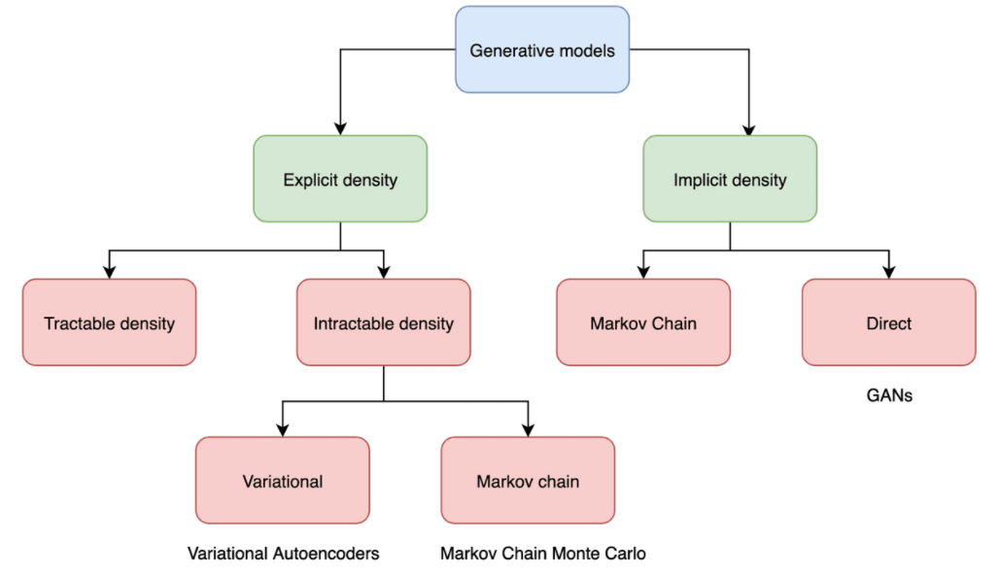

# 1 What are GANs?

> [reference](https://theaisummer.com/latent-variable-models/)

## 1.1 Discriminative vs Generative Models

**Discriminative models** learn the probability of a label y based on a data point $ x $ (i.e. approximating $ p(y|x) $).

**Generative models** learn a probability distribution over the data points without external labels $ p(x) $.

**Conditional Generative models** learn the probability distribution of data $ x $ conditioned on the labels y $ p(x|y) $.

## 1.2 Explicit vs Implicit Probabilistic Models

**Explicit**: computing density function $ p $ explicitly (e.g. variational autoencoder).

**Implicit**: the model samples from the underlying distribution without calculating $ p $.

$$ x = G(z) $$

$$ y = D(x) $$

