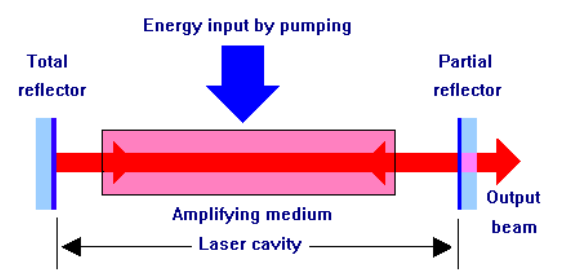
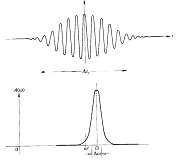
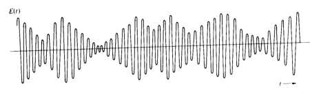
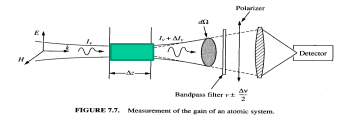
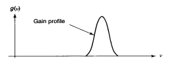

# 1 Overview
## 1.1 What are lasers?
> LASER = Light Amplification by Stimulated Emission of Radiation

Devices that generate or amplify coherent radiation at frequencies in infrared / visible / ultraviolet / soft-x-ray regions of the EM spectrum.

Types of lasers:
- Laser materials
- Atomic and moecular systems
- Pumping techniques

## 1.2 Elements of a laser

1. **Laser gain medium**: generate and amplify light
2. **Laser cavity**: provide suitable optical feedback
3. **Pumping process**: inject enegery into laser

# 2 Characteristics of Laser Radiation

> The most distinctive characteristics of laser emission are spatial coherence and spectral coherence.

## 2.1 Monochromaticity

The equation of an ideal monochromatic wave is:
$$u(\vec{r}, t)=a(\vec{r})\cos[\omega_0t+\phi(\vec{r})]$$

Of course, there are not monochromatic waves in real life. However, laser beams have a very narrow spectrum due to its nature (or generation process).

Spectral bandwidth of various light sources:
- Thermal light sources (lamps / sunlight): broadband continuum of frequencies
- Atomic transitions (sodium lamp): few to hundreds of GHz
- Stabilized lasers: tens of MHz to few Hz

Laser beam spectral linewidth $ \Delta v_L $
- Lasers still have small residual frequency / phase modulation / drift
- However, it can often be simplified as monochromatic wave
- We will learn to calculate the spectral linewidth in subsequent sections

In real life, an optical pulse is a superposition of monochromatic waves with frequencies distributed within a bandwidth $ \Delta \omega $ (assuming constant phases).

A practical quasi-monochromatic wave also has random phases, resulting in a series of wave train with average length $ 2 \pi / \Delta \omega $.

## 2.2 Spatial and Temporal Coherence

Coehrence measures the average correlation (spell, ability to interfere) between the wave at two different points in time (temporal) / space (spatial). An ideal monochromatic plane wave of course have perfect time and spatial coherence in free space.

### 2.2.1 Temporal Coherence

Coherence time is the time interval over which the light essentially behaves like a monochromatic wave.



$$ t_c \approx \frac{1}{\Delta v}  $$
$$ l_c = c \cdot t_c  $$

- $ \Delta v $: spectral line(band)width
- $ t_c $: coherence time
- $ l_c $: coherence length



To determine the coherence length of a light beam, we can use a Michelson interferometer to find the maximum optical path difference when the interference is still visible.

### 2.2.2 Spatial Coherence

In basic diffraction theory, a uniphase plane wave does not diffract in free space but has a minimum angular diffraction of $ \Delta \theta \approx \frac{1.22 \lambda}{D} $. For finite transverse beam cross-section, diffraction also happens in free space.

We can measure spatial coherence using Young's double slit experiement to find maximum slit separation for observable interference.

In general, laser beam has small divergence compared to other light sources.

## 2.4 Laser Power and Energy

Some other basic EM equations:



Poynting vector:
$$ P = E(t) \times H(t) $$

Optical intensity (power / area):
$$ I = \langle P \rangle = \frac{|E_0|^2}{2 \eta} $$
where $ \eta $ is impedance of the medium.



# 3 Atomic Radiation

It is a known fact that energy level transitions involve the emission or absorption of a photon where $ E_2 - E_1 = hv_{21} $.

## 3.1 Trnsitions
### 3.1.1 Spontaneous Emission

Spontaneous emission happens independent of other photons and emits photons in random directions and polarizationss.


$$ \frac{dN_2}{dt} = -A_{21}N_2 $$


### 3.1.2 Absorption
Absorption is induced by existing photons (of the right frequency).

$$ \frac{dN_2}{dt} = B_{12}N_1\rho(v) = -\frac{dN_1}{dt} $$
where $ \rho(v) $ is the energy density at frequency $ v $.


### 3.1.3 Stimulated Emission

Stimulated emission is induced of photons of the right frequency, which triggers the generation of another photon of the same polarization, energy etc.


$$ \frac{dN_2}{dt} = -B_{21}N_2\rho(v) = -\frac{dN_1}{dt} $$


## 3.2 Thermal Equilibrium (calculating the invariant relationship between the parameters)

Imagine that we have a box with temperature $ T $ which is at thermal equilibrium.

$$ \frac{dN_2}{dt} = -A_{21}N_2 + B_{12}N_1\rho(v) - B_{21}N_2\rho(v) = 0 $$

From Bolzmann distribution we know that (taking degeneracy factor into account):
$$ \frac{N_2}{N_1} = \frac{g_2}{g_1}exp(-\frac{hv}{k_bT}) $$

As such,
$$ \rho(v) = \frac{A_{21}}{B_{21}}\frac{1}{\frac{B_{12}g_1}{B_{21}g_2}e^{\frac{hv}{k_bT}} = 1} $$

Equating it with the black body radiation energy pdf:
$$ \rho(v) = \frac{8\pi n^3hv^3}{c^3}\frac{1}{e^{\frac{hv}{k_bT}} - 1} $$


$$ B_{12}g_1 = B_{21}g_2 $$
$$ \frac{A_{21}}{B_{21}} = \frac{8\pi n^3 hv^3}{c^3} $$


## 3.3 Radiative and Non-radiative Decay
Under thermal inequilibrium, atoms in upper energy level relax to all possible lower energy levels in different decay mechanisms.

Radiative decay is the spontaneous emission of EM radiation.

Nonradiative decay is the loss **of** energy from atomic oscillation into heating up the immediate surroundings in all other possible ways. It does not involve the absorption and emission of photons.

Total energy decays rate is the sum of the two. It is simply modelled as:

$$ \frac{dN_j}{dt} = -\sum_i r_{ji}N_j $$
where $ r_{ji} $ is the sum of radiative and non-radiative decay rates to lower energy levels (and its inverse is lifetime of the energy level).


$$ N_j(t) = N_j(t_0)e^{-r_j(t-t_0)} $$


# 4 Laser Gain and Linewidth Boradening
## 4.1 Lineshape Function

From the previous section, we understand that $ N_j = N_{j0}e^{-\frac{t}{\tau_j}} $.

From semiconductor class, we also know that energy levels in an atomic system broadens due to interference of wave functions. As such, light emitted / absorbed by the system will have finite spectral width.

The lineshape function $ g(V) $ describes the spectrum of light emitted / absorbed by an atom ensemble (it is a pdf, so it integrates to 1 over $ \mathbb{R} $).

### 4.1.1 Homogeneous Linewidth Broadening

When the atom ensemble has same individual lineshape function, resultant lineshape function is the same as an individual atom (duh).

Factors causing homogeneous linewidth broadening:
- Inelastic collision / transition to other energy levels
- Elastic phase destroying collisions (dephasing collisions)
- Interaction with an electromagnetic field (power broadening)

Function form: Normalized Lorentzian function
$$ g(v) = \frac{\Delta v}{2\pi[(v_o - v)^2 + (\frac{\Delta v}{2})^2]} $$

### 4.1.2 Inhomogeneous Broadening

When ensemble fo atoms can be split into different groups, by CLT the lineshape function is Gaussian.

Reasons for inhomogeneous broadening:
- In gases: Doppler effect
- In solids: Inhomogeneity of the host crystal

Function form: Gaussian function (not gonna type it out)

## 4.2 Optical Amplification and Gain
### 4.2.1 Interaction with wave of continuous spectrum

$$ \frac{dN_2}{dt} = -A_{21}N_2 + B_{12}N_1\rho(v) - B_{21}N_2\rho(v)$$

During the derivation of Einstein relations, we used this equation to model the atomic transition under a continuous spectrum. Note that $ \rho(v) $ in this case is modelled by Black body radiation.

### 4.2.2 Interaction with monochromatic wave

$$ \frac{dN_2}{dt} = -A_{21}N_2 + B_{12}N_1g(v)\rho_v - B_{21}N_2g(v)\rho(v)$$

In this case, we have a monochromatic wave with constant energy density (consider it a dirac delta function). Integrate it with $ g(v) $ and you get the energy density $ g(v)\rho_v $.

The situation is that we excite the atoms with a monochromatic light but only a portion of atoms interact with that frequency of light. Using Einstein relations and the light intensity $ I_v = \frac{c}{n} \cdot \rho_v $:


$$ \frac{dN_2}{dt} = A_{21}N_2 - A_{21}\frac{c^3}{8\pi n^3 h v^3} (N_2 - \frac{g_2}{g_1}N_1) g(v) \frac{I_v}{\frac{c}{n}} $$


### 4.2.3 Light Amplification

Imagine a system like this:

$$ \frac{dI_v}{dz} = \frac{d(hv * N_2 * speed)}{dz} = \frac{hv \cdot d(N_2)}{dt} $$

As such, the stimulated emission and absorption terms contribute to the intensity change as follows:

$$ \Delta I_v = hvB_{21}\frac{I_v}{c / n}g(v)N_2 \Delta z - hvB_{12} \frac{I_v}{c / n} g(v) N_1 \Delta z $$

But for spontaneous emission, under a practical setting, the captured intensity depends on the solid angle of the detector and the spectral width of the band filter.

$$ \Delta I_v = hv A_{21} (\Delta v/2) g(v) \frac{d \Omega}{4\pi} N_2 \Delta z $$

But since spontaneous emission can be ignored, so bye.

Integrating that, we get



$$ \frac{dI_v}{dz} = \gamma(v) I_v $$
$$ \gamma(v) = \frac{A_{21} \lambda_0^2}{8\pi n^2}(N_2 - \frac{g_2}{g_1} N_1) g(v) $$

And we can get the stimulated cross-section (which is fully determined by the atomic properties, with units of area):

$$ \sigma(v) = \frac{A_{21}\lambda_0^2}{8\pi n^2} g(v) $$



### 4.2.4 Popuation Inversion
$ \gamma(v) > 0 $ means amplification, $ \gamma(v) < 0 $ means attenuation. By the euqation, we can see that amplification happens when population inversion happens, i.e. $ N_2 - \frac{g_2}{g_1}N_1 > 0 $

### 4.2.5 Gain Profile

The gain profile is characterized by $ g(v) $ and fully frequency-dependent and has highest gain at $ v_{21} = \frac{E_2 - E_1}{h} $.

If we assume constant gain (i.e. small signal gain hmmmm, where $ d $ is the length of amplification), $ I_v(z) = e^{\gamma_0(v)d} I_v(0) $.