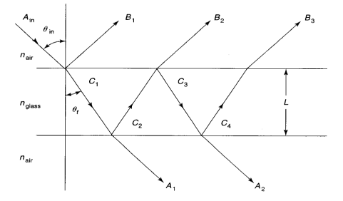
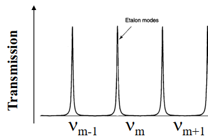

# 1 Fabry-Perot Etalon and Interferometer

## 1.1 Overview

A F-P etalon is an optical element consisting of two plane parllel reflective surfaces. Normally the area of the surfaces is large compared to their separation (if sepration is variable, it is a F-P interferometer).

## 1.2 Analysis

Let input be plane wave of amplitude $ A_{in} $ incident at angle $ \theta_{in} $:

- Total reflected signal = sum of all A beams
- Total transmitted signal = sum of all B beams

The phase delay between two partial waves is:
$$ \delta = \frac{2 \pi}{\lambda} \Delta l  = \frac{4 \pi nL \cos(\theta)}{\lambda}$$

B beams are: $ B_1 = rA_{in}, B_2 = tt'r'e^{i \delta}A_{in}, ... $

A beams are: $ A_1 = tt'A_{in}, A_2 = tt'r'^2e^{i \delta}A_{in}, ... $

where $ r,r' $ are the reflection coefficients (reflects amplitude)

As such,
$$ A_r = \frac{(1-e^{i \delta}) \sqrt{R}}{1-Re^{i \delta}}A_{in} $$
$$ A_t = \frac{T}{1-Re^{i \delta}}A_{in} $$
where $ R = r^2 = r'^2 $ and $ r' = -r $ and $ r^2 + tt' = 1 $



$$ \frac{I_t}{I_{in}} = \frac{A_tA_T^*}{A_{in}A_{in}^*} = \frac{(1-R)^2}{(1-R)^2+4R\sin^2(\frac{\delta}{2})}$$

When $ \delta = \frac{4\pi nL\cos(\theta)}{\lambda} = 2m\pi $ with integer $ m $,
$$ \frac{I_t}{I_{in}} = 1 $$

As such, resonant frequencies of the etalon are:
$$ v_m = m\frac{c}{2nL \cos(\theta)} $$



The free spectral range $ \Delta v_{FSR} = v_m - v_{m-1} = \frac{c}{2nL\cos(\theta)} $.


$$ F = \frac{\pi \sqrt{R}}{1-R} = \frac{\Delta v_{FSR}}{\Delta v_{FWHM}}$$


Near transmission peaks, $ \delta = 2m\pi + \Delta v $, hence $ \frac{I_t}{I_{in}} \frac{1}{a+F^2 (\Delta v)^2 / \pi^2} $ which is a Lorentzian function of $ \Delta v $ with FWHM of $ 2\pi / F $ (resolution of etalon).

# 2 Passive Optical Resonators

## 2.1 Overview
The function of an optical resonator is to build up large field intesities at specific resonance frequencies with moderate power input.

Resonator modes (mode = a discrete resonance frequency) are steady-state field distributions (eigenvalue solutions) oscillating inside a resonator. Steady-state means amplitude and phase reproduced after one cavity round trip.
	
There are two directions to the resonator modes: longitudinal and transverse.

## 2.2 Longitudinal Modes

