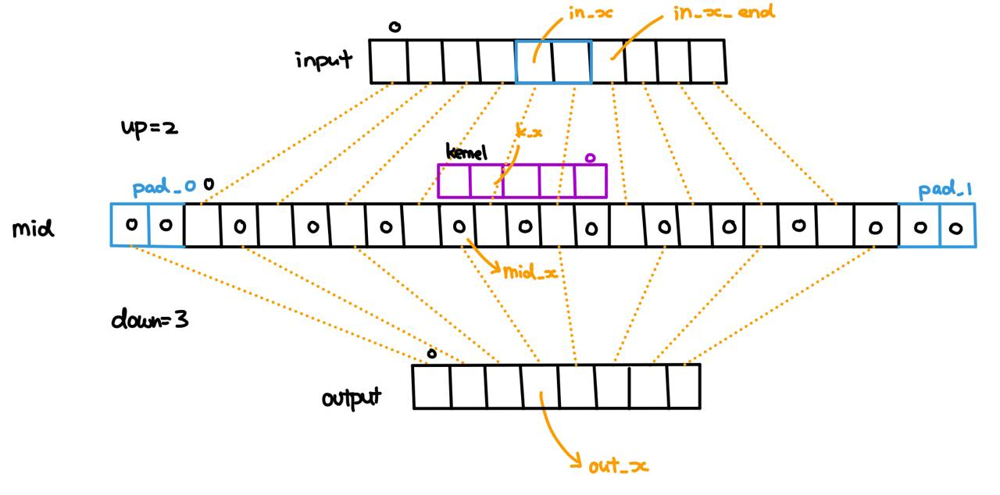

## 1. Motivation
During my final year project in university, I needed to train a StyleGAN2 model for X-ray image synthesis. I experimented with both [NVIDIA's official implementation](https://github.com/NVlabs/stylegan2-ada-pytorch) and [rosinality's implementation](https://github.com/rosinality/stylegan2-pytorch). I found the latter more stable during training and much simpler (such that I can incorporate it in my project repo more easily).

In the [StyleGAN2 paper](https://arxiv.org/pdf/1912.04958.pdf), the team mentioned that they implemented custom CUDA kernels to speed up the training time.

> This motivated us to optimize these operations using hand-written CUDA kernels. We implemented filtered up/downsampling as a single fused operation, and bias and activation as another one. In configuration E at $1024^2$ resolution, our optimizations improved the overall training time by about 30% and memory footprint by about 20%.

I wanted to understand the implementation of the CUDA kernels and the design considerations that went into the process. Sadly, the source code was not properly commented nor systematically explained anywhere. Hence, I took the time and effort to investigate its inner workings, simplify it and summarize my learnings here. My implementation can be found [here](https://github.com/ppeetteerrs/pytorch-cuda-kernels).

## 2. UpFirDn2D
The StyleGAN2 team implemented two custom kernels: `upfirdn2d` and `used_bias_act`. The latter is very simple as it is just a leaky ReLU that comes with a bias term. The former, on the other hand, is used for up/downsampling (by replacing the bilinear up/downsampling in the original StyleGAN paper).

The `upfirdn2d` is a very common signal processing operation where a signal (i.e. image in StyleGAN2) goes through the following steps:
1. upsampling (by adding zeros after each pixel)
2. padding (by adding zeros on each side of the image)
3. FIR filter (by convolution with a kernel)
4. downsampling (by dropping zeros after each pixel)

In StyleGAN2, up/downsampling operations use a separable 2D Gaussian kernel (`[1, 3, 3, 1]`). I 
believe it sort of achieves the same purpose as applying a blurring kernel before bilinear upsampling, which is to avoid aliasing using a low-pass filter before upsampling [see this](https://arxiv.org/pdf/1904.11486v2.pdf). In the `upfirdn2d` case, upsampling was done before the convolution but since the upsampling only involes zero padding, the blurring kernel still sort of removes the resulting high-frequency noise.

Having understood the purpose of the `upfirdn2d` kernel, let's look at the relevant [files](https://github.com/ppeetteerrs/pytorch-cuda-kernels/tree/main/upfirdn2d/new):
- `upfirdn2d.cpp`: C++ entrypoint
- `upfirdn2d_kernel.cu`: Actual CUDA kernel
- `upfirdn2d.py`: Python API and Pytorch autograd.Function definition


## 3. upfirdn2d.cpp
> Purpose of `<op_name>.cpp` is to **check input validity**, **set default CUDA device** and **create Python binding**.

*[source code]([docs_toc_foot](https://github.com/ppeetteerrs/pytorch-cuda-kernels/blob/main/upfirdn2d/new/upfirdn2d.cpp))*

#### 3.1 CUDA Input Checks + Device Guard

Typical CUDA checks simply verify that input tensors are on CUDA and contiguous. Additional checks on tensors shapes / constraints on function arguments can be added but are omitted here.

The `at::DeviceGuard` sets CUDA's default device to the desired one (if you have multiple GPUs) such that subsequent calls to  `cudaGetDevice` and  `at::cuda::getCurrentCUDAStream` can return the correct values. It also resets CUDA's default device when destructed (i.e. when the function returns).

```cpp
#define CHECK_CUDA(x) TORCH_CHECK(x.is_cuda(), #x " must be a CUDA tensor")
#define CHECK_CONTIGUOUS(x) \
	TORCH_CHECK(x.is_contiguous(), #x " must be contiguous")
#define CHECK_INPUT(x) \
	CHECK_CUDA(x);     \
	CHECK_CONTIGUOUS(x)

// Python function definition
torch::Tensor upfirdn2d(const torch::Tensor& input, const torch::Tensor& kernel,
						int up_x, int up_y, int down_x, int down_y, int pad_x0,
						int pad_x1, int pad_y0, int pad_y1,
						bool force_generic = false) {
	// Check input validity
	CHECK_INPUT(input);
	CHECK_INPUT(kernel);

	// Sets default CUDA device, and reset it when destructed.
	at::DeviceGuard guard(input.device());

	return upfirdn2d_op(input, kernel, up_x, up_y, down_x, down_y, pad_x0,
						pad_x1, pad_y0, pad_y1, force_generic);
}
```

#### 3.2 Python API Binding

There is nothing to be explained here.

```cpp
PYBIND11_MODULE(TORCH_EXTENSION_NAME, m) {
	m.def("upfirdn2d", &upfirdn2d, "upfirdn2d (CUDA)");
}
```

## 4. upfirdn2d_kernel.cu

*[source code]([docs_toc_foot](https://github.com/ppeetteerrs/pytorch-cuda-kernels/blob/main/upfirdn2d/new/upfirdn2d_kernel.cu))*

### 4.1 Misc

Our CUDA C++ file starts with a ceiling division utility function. This function is often needed when calculating the number of blocks / loops needed and when transforming between different indices. Note that `#define ceil_div (((a) + (b) - 1) / (b))` is technically wrong when dealing with negative values, but can still be used here since we are not dealing with negative numbers (all those extra parentheses to prevent [operator precedence problems](https://stuff.mit.edu/afs/athena/project/rhel-doc/3/rhel-cpp-en-3/macro-pitfalls.html)). However, `#define ceil_div (((a) - 1 / (b)) + 1)` is not usable as it is wrong at zero.

```cpp
static __host__ __device__ __forceinline__ int ceil_div(int a, int b) {
	int c = a / b;
	if (c * b < a) {
		c++;
	}
	return c;
}
```

We have also defined a structure for the parameters when calling `upfridn2d`:

```cpp
struct UpFirDn2DKernelParams {
	// Up / down sampling factors
	int up_x;
	int up_y;
	int down_x;
	int down_y;

	// Paddings
	int pad_x0;
	int pad_x1;
	int pad_y0;
	int pad_y1;

	// Input Dimensions
	int n;
	int in_h;
	int in_w;

	// Kernel Dimensions
	int kernel_h;
	int kernel_w;

	// Output Dimensions
	int out_h;
	int out_w;

	// Per-thread loop count along dimension n
	int loop_n;
};
```

### 4.2 Kernel Selection
As mentioned in my other post, NVIDIA likes to implement a generic and a templated version of the same kernel. As such, a function (`upfirdn2d_op`) to select between the kernel versions is needed. First, we begin by obtaining a contiguous view of the input tensors (not necessary tbh since the contiguous check has been performed). We also obtain the current CUDA stream for the invokation of the kernel function in a multi-GPu setup (default device set by the `at::DeviceGuard` in previous section).

```cpp
torch::Tensor upfirdn2d_op(const torch::Tensor& input,
                           const torch::Tensor& kernel, int up_x, int up_y,
                           int down_x, int down_y, int pad_x0, int pad_x1,
                           int pad_y0, int pad_y1, bool force_generic) {

    cudaStream_t stream = at::cuda::getCurrentCUDAStream();

    auto x = input.contiguous();
    auto k = kernel.contiguous();
```

As we all know, Pytorch tensors are 4-dimension with the dimensions of sample (`N`), channel (`C`), height (`H`) and width (`W`). Before the tensor is passed to `upfirdn2d_op`, it has been reshaped to `( N*C, 1, H, W )` since dimensions `N` and `C` does not make a difference. As such, we fill in the function parameters as follows:

```cpp
    UpFirDn2DKernelParams p;
    p.n        = x.size(0);
    p.in_h     = x.size(2);
    p.in_w     = x.size(3);
    p.kernel_h = k.size(0);
    p.kernel_w = k.size(1);
    p.up_x     = up_x;
    p.up_y     = up_y;
    p.down_x   = down_x;
    p.down_y   = down_y;
    p.pad_x0   = pad_x0;
    p.pad_x1   = pad_x1;
    p.pad_y0   = pad_y0;
    p.pad_y1   = pad_y1;
```

Subsequently, we calculate the output tensor size according to the input and kernel sizes using the formula (try to derive it, it is very simple): 

$$ out\\_w = \lceil ( in\\_w \times up\\_factor + paddings - (kernel\\_w - 1 )) \div down\\_factor \rceil $$

```cpp
    p.out_h = ceil_div(p.in_h * p.up_y + p.pad_y0 + p.pad_y1 - (p.kernel_h - 1),
                        p.down_y);
    p.out_w = ceil_div(p.in_w * p.up_x + p.pad_x0 + p.pad_x1 - (p.kernel_w - 1),
                       p.down_x);
    auto out = at::empty({p.n, 1, p.out_h, p.out_w}, x.options());
```

Next, we select the kernel mode based on the function parameters. `loop_n` controls the number of output pixels along the `N*C` dimension computed by each thread. The `grid_size` is determined by the number of blocks needed based on the above.

When using templated function (`mode>0`):
- 256 threads to compute output tiles of $ 32^2 $ (each block processes 4 pixels). This is both due to shared memory constraints and to reduce thread creation overheads.
- `loop_n=1`: no point reusing threads along the `N*C` dimension since `N*C` is very small in StyleGAN2 (batch size is like around 8 - 32)

When using templated function (`mode=-1`):
- 1024 threads each computing 1 output pixel. Since global memory is used, more threads = lower average memory access latency.
- `loop_n=8`: to reuse threads and reduce overheads (we launched more threads per block to reduce global memory access latency but we want each thread to be reused)

```cpp
int mode = -1;

    if (!force_generic) {
        if (p.up_x == 1 && p.up_y == 1 && p.down_x == 1 && p.down_y == 1 &&
            p.kernel_h == 4 && p.kernel_w == 4) {
            mode = 1;
        } else if (p.up_x == 2 && p.up_y == 2 && p.down_x == 1 &&
                   p.down_y == 1 && p.kernel_h == 4 && p.kernel_w == 4) {
            mode = 2;
        } else if (p.up_x == 1 && p.up_y == 1 && p.down_x == 2 &&
                   p.down_y == 2 && p.kernel_h == 4 && p.kernel_w == 4) {
            mode = 3;
        }
    }

    dim3 block_size;
    dim3 grid_size;

    if (mode > 0) {
        p.loop_n   = max(ceil_div(p.n, 16384), 1);
        block_size = dim3(256, 1, 1);
        grid_size  = dim3(ceil_div(p.out_w, 32), ceil_div(p.out_h, 32),
                          ceil_div(p.n, p.loop_n));
    } else {
        p.loop_n   = max(ceil_div(p.n, 16384), 8);
        block_size = dim3(32, 32, 1);
        grid_size =
            dim3(ceil_div(p.out_w, block_size.x),
                 ceil_div(p.out_h, block_size.y), ceil_div(p.n, p.loop_n));
    }
```

Having chosen the kernel version and grid + block sizes, we can finally invoke the kernel. Aten (aka Pytorch backend API) provides a convenient macro to take care of kernels templated with the tensor's data type. As such, you can see that we used the input tensor's (`x`) data type and called the invoked the corresponding kernel (which has template parameter `scalar_t`). `AT_DISPATCH_FLOATING_TYPES_AND_HALF` simply means that the tensor can have data type `double`, `float` or `at::Half`.

```cpp
    AT_DISPATCH_FLOATING_TYPES_AND_HALF(x.scalar_type(), "upfirdn2d_cuda", [&] {
        switch (mode) {
            case 1:
                upfirdn2d_kernel<scalar_t, 1, 1, 1, 1, 4, 4, 32, 32>
                    <<<grid_size, block_size, 0, stream>>>(
                        out.data_ptr<scalar_t>(), x.data_ptr<scalar_t>(),
                        k.data_ptr<scalar_t>(), p);
                break;

            case 2:
                upfirdn2d_kernel<scalar_t, 2, 2, 1, 1, 4, 4, 32, 32>
                    <<<grid_size, block_size, 0, stream>>>(
                        out.data_ptr<scalar_t>(), x.data_ptr<scalar_t>(),
                        k.data_ptr<scalar_t>(), p);
                break;

            case 3:
                upfirdn2d_kernel<scalar_t, 1, 1, 2, 2, 4, 4, 32, 32>
                    <<<grid_size, block_size, 0, stream>>>(
                        out.data_ptr<scalar_t>(), x.data_ptr<scalar_t>(),
                        k.data_ptr<scalar_t>(), p);
                break;

            default:
                upfirdn2d_kernel_generic<scalar_t>
                    <<<grid_size, block_size, 0, stream>>>(
                        out.data_ptr<scalar_t>(), x.data_ptr<scalar_t>(),
                        k.data_ptr<scalar_t>(), p);
                break;
        }
    });

    return out;
}
```

### 4.3 Generic Implementation `upfirdn2d_kernel_generic`

The generic implementation of the kernel is quite straightforward once understood. In the generic implementation, each thread computes `loop_n` output pixels: `[out_x, out_y, out_n_base : out_n_base + loop_n - 1]` in numpy syntax.

```cpp
template <typename scalar_t>
__global__ void upfirdn2d_kernel_generic(scalar_t* out, const scalar_t* input,
                                         const scalar_t*             kernel,
                                         const UpFirDn2DKernelParams p) {
    // Output pixel(s) (base) coordinates
    const int out_x      = blockIdx.x * blockDim.x + threadIdx.x;
    const int out_y      = blockIdx.y * blockDim.y + threadIdx.y;
    const int out_n_base = blockIdx.z * p.loop_n;

    if (out_x >= p.out_w || out_y >= p.out_h || out_n_base >= p.n) {
        return;
    }

```

Having known the output pixel coordinates, we need to map the coordinates back to the input and kernel spaces (i.e. coordinate system). The following diagram illustrates the translation process:



In the 1-dimension case, to compute the value of pixel `output[out_x]`, we need to start by setting `output[out_x] = input[in_x] * kernel[k_x]`. Then, we accumulate the sum by `output[out_x] += input[in_x + 1] * kernel[k_x - up_x]` (note that kernel is flipped since this is convolution not cross-correlation). We repeat the accumulation (with updated indices) until we reach `in_x == in_x_end - 1`. The relevant formula are:

$$ mid\\_x =  out\\_x \times down\\_x - pad\\_0 $$
$$ in\\_x = \lceil \frac{mid\\_x}{up\\_x} \rceil $$
Of course, `in_x` is clipped to `[0, in_w)`.
$$ in\\_x\\_end = \lceil \frac{mid\\_x + k\\_w}{up\\_x} \rceil $$
Basically, we find `in_x_end` by looking at the element after the last element in the `mid` layer and finding its corresponding coordinates in the `input` layer. This `in_x_end` element should be excluded from the accumulation (try to figure out why).
$$ k\\_x = k\\_w - 1 - (in\\_x \times up\\_x - mid\\_x) $$
The calculation for `k_x` should be intuitive. Just bear in mind that the kernel is flipped, so the index starts at `k_w - 1`.

The following code does exactly what we outlined above:

```cpp
template <typename scalar_t>
__global__ void upfirdn2d_kernel_generic(scalar_t* out, const scalar_t* input,
                                         const scalar_t*             kernel,
                                         const UpFirDn2DKernelParams p) {
    // Output pixel(s) (base) coordinates
    const int out_x      = blockIdx.x * blockDim.x + threadIdx.x;
    const int out_y      = blockIdx.y * blockDim.y + threadIdx.y;
    const int out_n_base = blockIdx.z * p.loop_n;

    if (out_x >= p.out_w || out_y >= p.out_h || out_n_base >= p.n) {
        return;
    }

    // Calculate middle layer (after upsampling) coordinates
    const int mid_x = out_x * p.down_x - p.pad_x0;
    const int mid_y = out_y * p.down_y - p.pad_y0;

    const int in_x = min(max(ceil_div(mid_x, p.up_x), 0), p.in_w);
    const int w =
        min(max(ceil_div(mid_x + p.kernel_w, p.up_x), 0), p.in_w) - in_x;
    const int kernel_x = p.kernel_w - 1 + mid_x - in_x * p.up_x;

    const int in_y = min(max(ceil_div(mid_y, p.up_y), 0), p.in_h);
    const int h =
        min(max(ceil_div(mid_y + p.kernel_h, p.up_y), 0), p.in_h) - in_y;
    const int kernel_y = p.kernel_h - 1 + mid_y - in_y * p.up_y;

    // Loop over DIM N
    for (int loop_n = 0, out_n = out_n_base; loop_n < p.loop_n && out_n < p.n;
         loop_n++, out_n++) {
        // Pointer to start of input and kernel
        const scalar_t* x_p = &input[(out_n * p.in_h + in_y) * p.in_w + in_x];
        const scalar_t* k_p = &kernel[kernel_y * p.kernel_w + kernel_x];

        // Pointer step sizes in DIM x
        const int x_px = 1;
        const int k_px = -p.up_x;

        // Pointer step sizes to move from (end_x, y) to (start_x, y+1)
        const int x_py = p.in_w - w * x_px;
        const int k_py = -p.up_y * p.kernel_w - w * k_px;

        scalar_t v = 0.0f;

        for (int y = 0; y < h; y++) {
            for (int x = 0; x < w; x++) {
                // Accumulate sum-product
                v += static_cast<scalar_t>(*x_p) * static_cast<scalar_t>(*k_p);
                // Move pointer in x-direction
                x_p += x_px;
                k_p += k_px;
            }

            x_p += x_py;
            k_p += k_py;
        }

        // Store output pixel
        out[(out_n * p.out_h + out_y) * p.out_w + out_x] = v;
    }
}
```

## 4.4 Templated Implementation

The templated version of the kernel is logically identical with a few minor changes. First, we calculate the size of the output tile that the thread block is responsible for (it is known at compile time) and allocate the shared memory statically. Then, we calculate the base coordinates of the block's output tile.

```cpp
template <typename scalar_t, int up_x, int up_y, int down_x, int down_y,
          int kernel_h, int kernel_w, int tile_out_h, int tile_out_w>
__global__ void upfirdn2d_kernel(scalar_t* out, const scalar_t* input,
                                 const scalar_t*             kernel,
                                 const UpFirDn2DKernelParams p) {
    // Size of input tile to obtain desired size of output tile (reverse of the
    // previous step in calculating overall output size)
    constexpr int tile_in_h =
        ((tile_out_h - 1) * down_y + kernel_h - 1) / up_y + 1;
    constexpr int tile_in_w =
        ((tile_out_w - 1) * down_x + kernel_w - 1) / up_x + 1;

    // Shared (transposed) kernel and shared x
    __shared__ volatile float sk[kernel_h][kernel_w];
    __shared__ volatile float sx[tile_in_h][tile_in_w];

    // Block Information (no checks on block_out_x < p.out_w cuz it will be
    // checked on host)
    const int tile_out_x      = blockIdx.x * tile_out_w;
    const int tile_out_y      = blockIdx.y * tile_out_h;
    const int tile_out_n_base = blockIdx.z * p.loop_n;

    if (tile_out_x >= p.out_w | tile_out_y >= p.out_h |
        tile_out_n_base >= p.n) {
        return;
    }
```

Next, all threads simultaneously load the (flipped) kernel into shared memory. Take note of the block-stride technique mentioned in my other CUDA post.

```cpp
    for (int tap_idx = threadIdx.x; tap_idx < kernel_h * kernel_w;
         tap_idx += blockDim.x) {
        int ky = tap_idx / kernel_w;
        int kx = tap_idx - ky * kernel_w;

        sk[ky][kx] =
            kernel[(p.kernel_h - 1 - ky) * p.kernel_w + (p.kernel_w - 1 - kx)];
    }
```

Having loaded the kernel, we loop over `loop_n` and load the input array into shared memory in each iteration. The coordinate transformation logic is the same as the generic version.

```cpp
    for (int loop_n = 0, tile_out_n = tile_out_n_base;
         loop_n < p.loop_n & tile_out_n < p.n; loop_n++, tile_out_n++) {
        // Starting coordinates of block's output tile
        int tile_mid_x = tile_out_x * down_x - p.pad_x0;
        int tile_mid_y = tile_out_y * down_y - p.pad_y0;
        int tile_in_x  = ceil_div(tile_mid_x, up_x);
        int tile_in_y  = ceil_div(tile_mid_y, up_y);

        __syncthreads();

        // Load shared input
        for (int in_idx = threadIdx.x; in_idx < tile_in_h * tile_in_w;
             in_idx += blockDim.x) {
            // Calculate relative coordinates in input
            int rel_in_y = in_idx / tile_in_w;
            int rel_in_x = in_idx - rel_in_y * tile_in_w;
            int in_x     = rel_in_x + tile_in_x;
            int in_y     = rel_in_y + tile_in_y;

            if (in_x >= 0 & in_y >= 0 & in_x < p.in_w & in_y < p.in_h) {
                sx[rel_in_y][rel_in_x] =
                    input[(tile_out_n * p.in_h + in_y) * p.in_w + in_x];
            }
        }

        __syncthreads();
```

Lastly, in each `loop_n` iteration, each thread might be responsible for multiple pixels (depending on number of threads per block vs output tile size per block). Hence, we compute the output pixels that the thread is responsible for using the shared memory values. Also notice the unrolling technique as mentioned in my other CUDA post.

```cpp
        // Accumulate output
        for (int out_idx = threadIdx.x; out_idx < tile_out_h * tile_out_w;
             out_idx += blockDim.x) {
            // Calculate relative coordinates in output
            int rel_out_y = out_idx / tile_out_w;
            int rel_out_x = out_idx - rel_out_y * tile_out_w;
            int out_x     = rel_out_x + tile_out_x;
            int out_y     = rel_out_y + tile_out_y;

            // Calculate cooresponding coordinates in input
            int mid_x    = tile_mid_x + rel_out_x * down_x;
            int mid_y    = tile_mid_y + rel_out_y * down_y;
            int in_x     = ceil_div(mid_x, up_x);
            int in_y     = ceil_div(mid_y, up_y);
            int rel_in_x = in_x - tile_in_x;
            int rel_in_y = in_y - tile_in_y;
            int kernel_x = in_x * up_x - mid_x;
            int kernel_y = in_y * up_y - mid_y;

            scalar_t v = 0.0;

#pragma unroll
            for (int y = 0; y < kernel_h / up_y; y++)
#pragma unroll
                for (int x = 0; x < kernel_w / up_x; x++)
                    v += sx[rel_in_y + y][rel_in_x + x] *
                         sk[kernel_y + y * up_y][kernel_x + x * up_x];

            if (out_x < p.out_w & out_y < p.out_h) {
                out[(tile_out_n * p.out_h + out_y) * p.out_w + out_x] = v;
            }
        }
    }
}
```

## 6. upfirdn2d.py

*[source code](https://github.com/ppeetteerrs/pytorch-cuda-kernels/blob/main/upfirdn2d/new/upfirdn2d.py)*

*[more info](https://pytorch.org/tutorials/advanced/cpp_extension.html)*

### 6.1 Loading

The Python portion of the code is relatively simple. We first start by loading the custom CUDA kernels. Note that `ninja` is required to compile the kernels on first launch (install with `sudo apt-get install ninja-build`). Subsequent calls will use the cached kernels unless the source code changed. `verbose` is set to true to monitor compilation progress.

```python
import os
from collections import abc
from typing import Any, Optional, Tuple, Union

import torch
from torch import Tensor
from torch.autograd import Function
from torch.utils.cpp_extension import load

# Load Pytorch extension
module_path = os.path.dirname(__file__)
upfirdn2d_op = load(
    "upfirdn2d_new",
    sources=[
        os.path.join(module_path, "upfirdn2d.cpp"),
        os.path.join(module_path, "upfirdn2d_kernel.cu"),
    ],
    verbose=True,
)
```

Next, we can define our autograd Function by supplying the `forward` and `backward` static methods. Note that we defined the gradient function as another autograd Function such that second derivatives are supported (but it is completely unnecessary). There are a few points to note:
1. Gradient computation: The derivative to the `upfirdn2d` operation is simply the same operation applied with reverse up/downsampling factors and a flipped kernel (just like the gradient of a convolution). It is simple to derive that.
2. Lazy computation: use `ctx.needs_input_grad` to avoid computing unnecessary gradients.
3. Please refer to [this](https://pytorch.org/docs/stable/notes/extending.html) if you are not familiar with custom autograd Functions

```python
class UpFirDn2dBackward(Function):
    @staticmethod
    def forward(
        ctx: Any,
        grad_output: Tensor,
        kernel: Tensor,
        grad_kernel: Tensor,
        up: Tuple[int, int],
        down: Tuple[int, int],
        pad: Tuple[int, int, int, int],
        g_pad: Tuple[int, int, int, int],
        in_size: Tuple[int, int, int, int],
        out_size: Tuple[int, int],
    ) -> Tensor:
        # Destructuring
        up_x, up_y = up
        down_x, down_y = down
        g_pad_x0, g_pad_x1, g_pad_y0, g_pad_y1 = g_pad

        grad_output = grad_output.reshape(-1, out_size[0], out_size[1], 1)

        # Gradient equals to applying sampling in reverse order with flipped kernel
        grad_input = upfirdn2d_op.upfirdn2d(
            grad_output,
            grad_kernel,
            down_x,
            down_y,
            up_x,
            up_y,
            g_pad_x0,
            g_pad_x1,
            g_pad_y0,
            g_pad_y1,
        )
        grad_input = grad_input.view(in_size[0], in_size[1], in_size[2], in_size[3])

        # Save kernel for double derivative
        ctx.save_for_backward(kernel)

        # Context caching
        pad_x0, pad_x1, pad_y0, pad_y1 = pad

        ctx.up_x = up_x
        ctx.up_y = up_y
        ctx.down_x = down_x
        ctx.down_y = down_y
        ctx.pad_x0 = pad_x0
        ctx.pad_x1 = pad_x1
        ctx.pad_y0 = pad_y0
        ctx.pad_y1 = pad_y1
        ctx.in_size = in_size
        ctx.out_size = out_size

        return grad_input

    @staticmethod
    def backward(
        ctx: Any, gradgrad_input: Tensor
    ) -> Tuple[Optional[Tensor], None, None, None, None, None, None, None, None]:
        # Load saved kernel
        (kernel,) = ctx.saved_tensors

        # Only compute gradient if requested
        gradgrad_out = None
        if ctx.needs_input_grad[0]:
            gradgrad_input = gradgrad_input.reshape(
                -1, 1, ctx.in_size[2], ctx.in_size[3]
            )
            gradgrad_out = upfirdn2d_op.upfirdn2d(
                gradgrad_input,
                kernel,
                ctx.up_x,
                ctx.up_y,
                ctx.down_x,
                ctx.down_y,
                ctx.pad_x0,
                ctx.pad_x1,
                ctx.pad_y0,
                ctx.pad_y1,
            ).view(ctx.in_size[0], ctx.in_size[1], ctx.out_size[0], ctx.out_size[1])

        return gradgrad_out, None, None, None, None, None, None, None, None


class UpFirDn2d(Function):
    @staticmethod
    def forward(
        ctx: Any,
        input: Tensor,
        kernel: Tensor,
        up: Tuple[int, int],
        down: Tuple[int, int],
        pad: Tuple[int, int, int, int],
        force_generic: bool,
    ) -> Tensor:
        # Destructuring
        up_x, up_y = up
        down_x, down_y = down
        pad_x0, pad_x1, pad_y0, pad_y1 = pad
        kernel_h, kernel_w = kernel.shape
        _, channel, in_h, in_w = input.shape

        # Cache input shape for backward function
        ctx.in_size = input.shape

        # Reduce input to 3 dimensions
        input = input.reshape(-1, 1, in_h, in_w)

        # Cache kernel and flipped kernel for backward function
        ctx.save_for_backward(kernel, torch.flip(kernel, [0, 1]))

        # Calculate output size
        out_h = (in_h * up_y + pad_y0 + pad_y1 - kernel_h + down_y) // down_y
        out_w = (in_w * up_x + pad_x0 + pad_x1 - kernel_w + down_x) // down_x

        # Calculate gradient padding
        g_pad_x0 = kernel_w - pad_x0 - 1
        g_pad_y0 = kernel_h - pad_y0 - 1
        g_pad_x1 = in_w * up_x - out_w * down_x + pad_x0 - up_x + 1
        g_pad_y1 = in_h * up_y - out_h * down_y + pad_y0 - up_y + 1

        # Context caching
        ctx.out_size = (out_h, out_w)
        ctx.up = (up_x, up_y)
        ctx.down = (down_x, down_y)
        ctx.pad = (pad_x0, pad_x1, pad_y0, pad_y1)
        ctx.g_pad = (g_pad_x0, g_pad_x1, g_pad_y0, g_pad_y1)

        # Apply kernel
        out = upfirdn2d_op.upfirdn2d(
            input,
            kernel,
            up_x,
            up_y,
            down_x,
            down_y,
            pad_x0,
            pad_x1,
            pad_y0,
            pad_y1,
            force_generic,
        ).view(-1, channel, out_h, out_w)

        return out

    @staticmethod
    def backward(
        ctx: Any, grad_output: Tensor
    ) -> Tuple[Optional[Tensor], None, None, None, None]:

        # Load saved kernel
        kernel, grad_kernel = ctx.saved_tensors

        # Only compute gradient if requested
        grad_input = None
        if ctx.needs_input_grad[0]:
            grad_input = UpFirDn2dBackward.apply(
                grad_output,
                kernel,
                grad_kernel,
                ctx.up,
                ctx.down,
                ctx.pad,
                ctx.g_pad,
                ctx.in_size,
                ctx.out_size,
            )

        return grad_input, None, None, None, None


def upfirdn2d(
    input: Tensor,
    kernel: Tensor,
    up: Union[int, Tuple[int, int]] = 1,
    down: Union[int, Tuple[int, int]] = 1,
    pad: Union[Tuple[int, int], Tuple[int, int, int, int]] = (0, 0),
    force_generic: bool = False,
) -> Tensor:

    if not isinstance(up, abc.Iterable):
        up = (up, up)

    if not isinstance(down, abc.Iterable):
        down = (down, down)

    if len(pad) == 2:
        pad = (pad[0], pad[1], pad[0], pad[1])

    out = UpFirDn2d.apply(input, kernel, up, down, pad, force_generic)

    return out
```