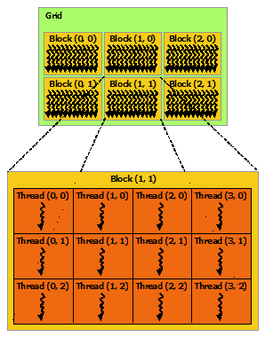
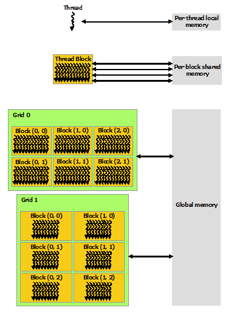
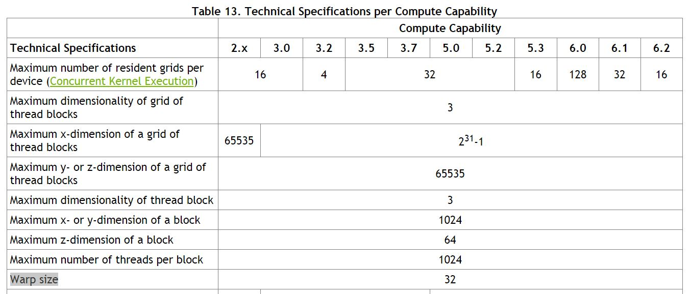

## 1. Core Concepts

> CUDA C++ is an extension to C++ that allows the definition of **kernel** functions which, when called, are executed in **parallel** on the (GPU) device.

*[Relevant blog posts](https://www.cnblogs.com/1024incn/tag/CUDA/)*

### 1.1 Function Execution Space Specifiers

#### 1.1.1 Host vs Device

Since the CUDA C++ compiler can generate function definitions on either the host (CPU) or device (GPU), it is necessary to specify the location where each function would be called from and executed on.

`__device__`: A `__device__` function is callable and executed on the device only.

`__host__`: A `__host__` function is callable and executed on the host only.

A function can be both `__device__` and `__host__`. It just means that the compiler should generate the routine for both the CPU and GPU. A function without the `__device__`, `__host__` or `__global__` specifiers defaults to `__host__`.

#### 1.1.2 Kernel

> A kernel function is defined using `__global__` and invoked using the `<<<...>>>` execution syntax (see below).

There are three main features of a kernel function:
1. `__global__` specifier: A kernel function is defined using the `__global__` specifier to indicate that it should be called from the host and executed on the device[^1]. It must have `void` return type. 
2. Execution configuration: A kernel function is invoked using the `<<<...>>>` execution configuration (explained below).
3. Built-in variables: A kernel function has access to built-in runtime variables such as `blockIdx`, `blockDim` and `threadIdx` to help determine the index of the thread on which the kernel is executed.

[^1]: Technically it can also be called from the device but what's the point...

An example of a simple kernel is shown below:

```cpp
__global__ void VecAdd(float* A, float* B, float* C)
{
    int i = threadIdx.x;
    C[i] = A[i] + B[i];
}

int main()
{
    ...
    VecAdd<<<1, N>>>(A, B, C);
    ...
}
```

#### 1.1.3 Inlining

`__noinline__`: Not to inline the (`__device__`) function if possible.

`__forceinline__`: Force the compiler to inline the (`__device__`) function.

### 1.2 Thread Hierarchy and Execution Configuration



The parallel execution of a CUDA kernel is organized into abstract blocks and threads which would be scheduled to execute in parallel on the GPU's Streaming Multiprocessors (SM). A kernel (aka `__global__` function) is invoked using the `xxx<<<Dg, Db, Ns, S>>>` execution configuration to specify the number of blocks and threads needed.

`Dg` (`dim3`): Dimension of the grid. Can be an integer or 3-tuple. `Dg.x * Dg.y * Dg.z` gives the total number of blocks launched (Max: `(2147483647, 65535, 65535)`).

`Db` (`dim3`): Dimension of the block. Can be an integer or 3-tuple. `Db.x * Db.y * Db.z` gives the total number of threads launched (Max: `(1024, 1024, 64)` with max `1024` threads in each block).

`Ns` (`size_t`): Number of bytes in shared memory that is dynamically allocated.

`S` (`cudaStream_t`): Associated CUDA stream.

### 1.3 Memory Hierarchy



A CUDA GPU contains global memory (DDR5 VRAM), block-level shared memory and per-thread register memory in decreasing latency. The latency of shared memory is around 100x lower than the global memory. Although the GPU scheduler will schedule other threads to execute while the active threads are waiting for a memory response, it is often helpful to cache frequently accessed arrays in the shared memory.

Usually, shared memory data are collaboratively loaded by all threads in a block. It is hence important to add a `__syncthreads()` memory fence after memory loading to ensure data validity. This memory fence also eliminates the need to declare the shared memory as `volatile`.

Shared memory can be allocated statically (preferred) or dynamically. The example below shows a statically allocated shared memory:

```cpp
__global__ void staticReverse(int *d, int n)
{
  __shared__ int s[64];
  int t = threadIdx.x;
  int tr = n-t-1;
  s[t] = d[t];
  __syncthreads();
  d[t] = s[tr];
}
```

Dynamically allocated shared memory should only be used when the amount is unknown at cmopile time. In this case, you must specify the amount of required memory during kernel invokation.

```cpp
__global__ void dynamicReverse(int *d, int n)
{
  extern __shared__ int s[];
  int t = threadIdx.x;
  int tr = n-t-1;
  s[t] = d[t];
  __syncthreads();
  d[t] = s[tr];
}

// Invokation
...
dynamicReverse<<<1, n, n*sizeof(int)>>>(d_d, n);
...
```

# 2. Optimization Techniques

## 2.1 Thread Warp



In a CUDA device, threads in a block are scheduled to execute in warps of continuous `threadIdx` (for a 3-dim block, `threadIDx = threadIDx.x + threadIDx.y * blockDim.x + threadIDx.z * blockDim.x * blockDim.y`). Threads in the same warp execute the same instructions and fetch data (SIMD) at the same time. As such, it is best to allocate threads in multiples of 32.

## 2.2 Global Memory Coalescing

*References: [1](https://developer.nvidia.com/blog/how-access-global-memory-efficiently-cuda-c-kernels/), [2](https://developer.nvidia.com/blog/cuda-pro-tip-write-flexible-kernels-grid-stride-loops/)*

If threads are executed in warps of 32, adjacent threads should load adjacent data entries when reading from global memory such that data can be loaded more efficiently. For example,

```cpp
__global__ void saxpy(int n, float a, float *x, float *y)
{
    for (int i = blockIdx.x * blockDim.x + threadIdx.x;
        i < n; i += blockDim.x * gridDim.x)
      {
          y[i] = a * x[i] + y[i];
      }
}
```

## 2.3 Looping in Threads

Many people might think that assigning one thread per array index (or pixel) is the most efficient way to parallelize a loop. However, that is not effectively true for a two reasons:
1. Limited shared memory: We have learnt that shared memory can speed up memory accesses (which are way more time-consuming than arithmetic operations). However, the amount of shared memory available per block is very limited. Often, it is be better to use 256 threads per block with data caching (in shared memory) than to use 1024 threads per block with no data caching (directly using global memory).
2. Thread overhead: The creation and scheduling of threads incur some overhead. Hence, adequately reusing threads might be more beneficial than allocating more blocks (e.g. each thread processing 4 pixels).

## 2.4 Function Templating

Anyone familiar with C++ knows that the compiler can perform certain compile-time optimizations such as loop unrolling (given that the loop size is known at compile time). As such, one design pattern commonly found in NVIDIA's CUDA kernels is the implementation of a **generic version** and a **templated version** of the same kernel.

The generic version uses global memory and no loop unrolling such that it can process arrays / tensors of any sizes (that fits inside the GPU memory). The templated version is compiled for the most common use cases (i.e. function arguments / array sizes) such that shared memory can be statically allocated and loops can be unrolled using `#pragma unroll`.


```cpp
torch::Tensor upfirdn2d(const torch::Tensor& input, const torch::Tensor& kernel,
						int up_x, int up_y, int down_x, int down_y, int pad_x0,
						int pad_x1, int pad_y0, int pad_y1,
						bool force_generic = false) {
	// Check input validity
	CHECK_INPUT(input);
	CHECK_INPUT(kernel);

	// Sets default CUDA device, and reset it when destructed.
	at::DeviceGuard guard(input.device());

	return upfirdn2d_op(input, kernel, up_x, up_y, down_x, down_y, pad_x0,
						pad_x1, pad_y0, pad_y1, force_generic);
}
```
