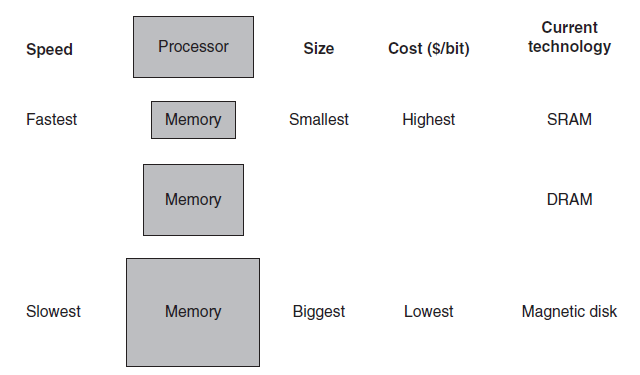
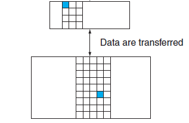
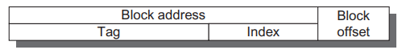
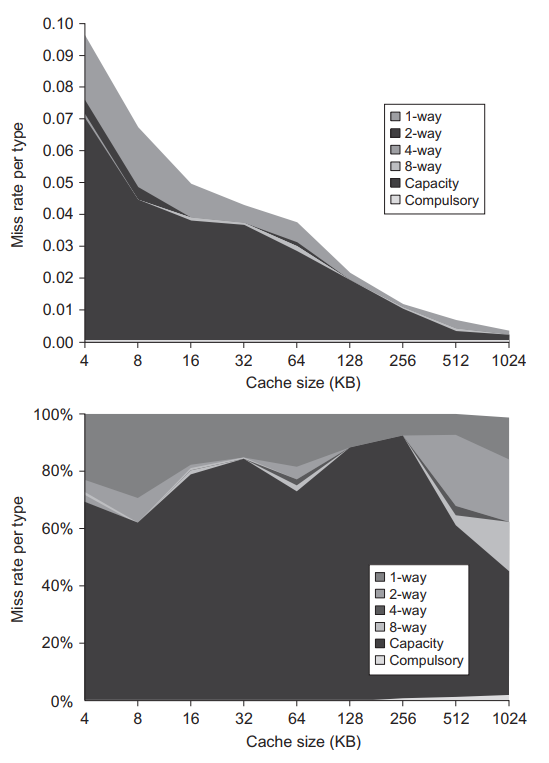
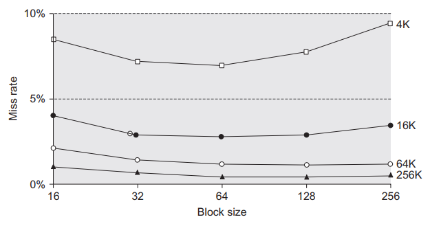
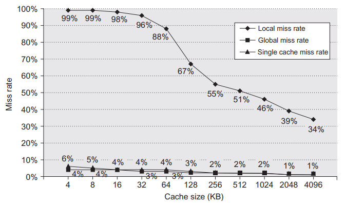

# 1 Introduction

> In the real world, computer memory size and speed are proportional to cost. However, the principles of locality allow us to design a hierarchical memory system which has a cost per byte almost as low as the cheapest level of memory and a speed almost as fast as the fastest level.

In an ideal world, computers should have an unlimited amount of fast memory. However, in the real world, we understand speed always comes at the expense of cost and size. In order to create an illusion of having unlimited fast memory, we make use of the concept called memory hierarchy.

A memory hierarchy **takes advantage of the principles of locality and trade-offs in the cost-performance of memory technologies**. An ideal memory hierarchy will have a cost per byte almost as low as the cheapest level of memory and a speed almost as fast as the fastest level.

The importance of memory hierarchy grows with advances in performance of processors. The slow performance growth of memory technologies have limited the growth of processor performance due to limited bandwidth and long access time. While caches can greatly improve memory access times, power budget comes into place, limiting the size of the caches that can be used.

## 1.1 Principles of Locality

> Temporal locality suggests that items are likely to be requested repeatedly in a short period. 
>
> Spatial locality means items near the current item will likely be requested soon.

The analogy to the memory hierarchy design is a PhD student searching for books to write his thesis. The student will be sitting at a desk to write his paper. Everytime he needs a book, he will search his desk to see if he has already retrieved that book before. If not, he will search through the shelves, likely **addressed** alphabeticaly by the subject followed by title of the book. He will then retrieve the book and put (**cache**) it on his desk. Once he has accumulated a good amount of books on his desk, it is very unlikely that he would need to return to the shelves for a new book. The ability to store a small collection of frequently accessed books on the table allows the student to save a tremendous amount of time compared to returning to the shelve for a new book everytime.

Of course, this time-saving effect can only be realized because of these two principles (or reasonable assumptions):
1. **Temporal (time) locality**: items accessed recently are likely accessed again soon
2. **Spatial locality**: items near recently accessed items are likely to be accessed (thats why libraries group book by subject)

It is now obvious that since computer programs involve frequent access to memory, the performance is heavily reliant on the degree of such localities (because of the hierarchical memory). As such, programmers, compilers, OS etc. cannot simply think of memory as a flat, random-access storage device.

## 1.2 Memory Hierarchy

> A memory hierarchy can be thought of as multiple of upper-lower level pairs starting from the processor.

The concept of **memory hierarchy** is simple. We have multiple levels of memory with different speeds and sizes connected in a hierarchical manner where the fastest memory (usually also the smallest) is connected directly to the processor. The data at a higher memory level is usually a subset of the data at the next level.

> Note that in reality there are other hardware components between each level of memory, e.g. MMU between L1 and L2 caches, bus interconnects etc. This caused a great deal of confusion for me at first where I imagined the hierarchy to be a chain of wires.
>
> 

Because of the hierarchical structure of memory, we can think of each pair of levels of memory as an upper and lower level. Using this abstraction, we define the following concepts:

- **Block / line**: the minimum unit of information that is present / not present in the two-level hierarchy (in the library example, the unit is a book)
- **Hit rate**: the fraction of memory accesses found in upper level
- **Miss rate**: 1 - hit rate
- **Hit time**: time to access the upper level of memory hierarchy (including time needed to determine if it is a hit or miss)
- **Miss penalty**: time required to fetch a block into upper level from lower level, including time to access the block, transmit it to upper level, insert it in upper level, and pass the block to the requestor (this is dependent on both the latency and the bandwidth of the memory)

# 2 Basics of Caches
From the previous sections, we understand that caches are fast but small memories connected near the processor. When a processor requests for a certain unit of information (i.e. by specifying an address), the cache returns the data if it is in the cache (**cache hit**), or fetches it from a lower level memory if it is not (**cache miss**). When a cache miss happens, a fixed-size collection of data containing the requested word called a **block** or line run, is retrieved from the main memory and placed into the cache.

## 2.1 Cache Performance

> Cache performance is measured by the number of memory stall cycles.

We have now understood that memory hierarchy can substantially improve performance, but a method to evaluate the performance is needed. From a simplified view:

$$\text{memory stall cycles} = \text{number of misses} \times \text{miss penalty}$$

$$\text{memory stall cycles} = \text{IC} \times \frac{\text{memory accesses}}{instruction} \times \text{miss rate} \times \text{miss penalty}$$

Having understood how to measure cache performance, we now come to the four main considerations regarding caches:

1. **Block placement / mapping**: where do we place a block in the cache? (the upper level is smaller that the lower level, so a mapping from the lower address space to the upper address space is needed)
2. **Block identification**: how do we quickly locate (or report a miss) a data item in the cache?
3. **Block replacement**: which block should be replaced on a miss? (it is related to the mapping because the mapping cannot be one-to-one)
4. **Write strategy**: what happens on a write?

## 2.2 Block Placement

> Mapping strategies is a spectrum from 1-way (direct mapping) to fully associative.

### 2.2.1 Direct Mapping
Direct mapping basically means modulo, i.e. the dummy's way to store data in a smaller address space.
$$\text{cache block address} = \text{processor block address % no. of blocks in cache}$$

That's why direct-mapped cache sizes have to be power of two for efficiency (using lower n bits of address as cache address). 

### 2.2.2 n-way associative (or fully associative)

**Set associative**: a block can be placed in a restricted set of places in the cache. A **set** is a group of blocks. A block is first mapped onto a set, an then the block can be placed anywhere within that set. Set is usually chosen by **bit selection**:

$$\text{set address} = \text{processor block address % no. of sets in cache}$$

If there are n blocks in a set, the cache placement is called n-way set associative.

Actually, it is a spectrum from direct mapping to fully associative as direct mapping  = 1-way associative.

## 2.3 Block Identification

> Processor address is split into index (set address), tag (block address), block offset (selecting byte).

Caches have an address tag on each block frame that gives the block address. The tags of potential matches are all checked in parallel against the target address. Often, a **valid bit** is also included to signal the validity of the data inside the cache block. The picture below shows the breakdown of the processor’s address:

- **Block address**
  - **Index**: selects the set
  - **Tag**: compared for a hit
- **Block offset**: selects the data inside the block

The spectrum from direct mapping to fully associative is defined by the line between tag and index bits.

## 2.4 Block Replacement

> We should replace the least recently used (LRU) block, but it is expensive to calculate. Pseudo-LRU can efficiently approximate LRU.

Replacement is necessary when a miss occurs, as the cache controller must select a block to be replaced with the desired data. There is no such choice in direct-mapped placement. However, replacement strategy is needed in set associative placement to choose the block in a set to replace. There are three primary strategies:

- **Random**: pseudorandom block numbers are used
- **Least recently used (LRU)**: replace the one that has been unused for the longest time
- **First in, first out (FIFO)**: simplifies LRU by replacing oldest block

It is apparent that LRU makes the most sense in an ideal world, but it is also the most expensive in hardware. A common approximation (pseudo-LRU) has a set of bits for each set in the cache with each bit corresponding to a single way (there are n ways in a n-way set associative cache). When a block is accessed, the bit for its way is turned on. If all bits are turned on, they are reset with the most recent staying on. This approximates LRU in an obvious manner.

## 2.5 Write Strategy

While reads dominate processor cache accesses (so making the common case fast = optimizing caches for reads), the speed of writes cannot be neglected in high-performance designs.

The optimization for read is easy. The block can be read from the cache at the same time that the tag is read and compared. It it is a hit, the requested part can be passed on immediately. If it is a miss, there is no harm except for wastage of power.

However, the same is not true for writes, modification of a block cannot begin until the tag is checked to see if the address is a hit. Because tag checking cannot occur in parallel, writes usually take longer than reads. Another complexity is that the processor also specifies the size of the write, usually between 1-8 bytes. Only that portion of a block can be changed. In contrast, reads can access more bytes than necessary.

There are two basic write hit policies for caches:

- **Write through**: the information is written to both the block in the cache and to the block in the lower-level memory
  - advantage: easier to implement and simplifies data coherency (also penalty is not that great if upper level uses write through, because it propagates to lower level caches only)
- **Write back**: the information is written only to the block in the cache. The modified cache block is written to main memory only when it is replaced
  - advantage: most writes happen at the speed of cache memory, also requires less bandwidth and power

To reduce the frequency of writing back blocks on replacement, a **dirty bit** indicates whether the block is modified.

Cycles spent waiting for writes to complete are called **write stalls**. We can use a **write buffer** to reduce write stalls (by forwarding data in pipeline).

There are  write miss policies:

- **Write allocate**: block is allocated on a write miss, followed by preceding write hit actions
- **No-write allocate**: write misses do not affect the cache, block is only modified in lower-level memory

# 3 More on Cache Performance
> Cache has a larger impact on performance for CPUs with faster clocks and lower CPI
>
> Using stall cycles or miss rate to measure cache performance is a poor choice as it is hardware independent. A good measure should provide a comparison between memory designs with different clock speeds and architectures (e.g. split caches vs unified cache). As such, the memory access time can be used:

$$\text{average memory access time} = \text{hit time} + \text{miss rate} \times \text{miss penalty}$$

While average memory access time is a good measure for memory performance, it cannot replace execution time for processor performance. First, memory is not the only reason for processor stalls. Also, the processor can be out-of-order, where it is not always stalled during misses.

However, assuming an in-order processor:
$$ \text{CPU time} = (\text{CPU execution cycles} + \text{memory stall cycles}) \times \text{clock cycle time}$$

From this formula, we can see that cache behaviour has a large impact on performance of processors with low CPI and fast clock:
1. Lower CPI = higher relative impact of fixed number of cache miss clock cycles
2. When calculating CPI, the cache miss penalty is measured in clock cycles. Hence, faster clock means higher portion of CPI per cache miss

## 3.1 Miss Penalty and Out-of-Order Execution Processors
> In out-of-order situations, we have to remove the overlapped portion of stalls.

For O3 execution processors, wew need to redefine memory stalls:
$$\frac{\text{memory stall cycles}}{\text{instruction}} = \frac{\text{misses}}{\text{instruction}} \times (\text{total miss latency} - \text{overlapped miss latency})$$

We can similarly account for hit time using overlapped hit latency, or account for contention of memory resources by dividing total miss latency into latency with / without contention.

When applying this formula, we need to decide on the following:
- **Length of memory latency**: what to consider as the start and end of a memory operation
**Length of latency overlap**: what is the start of overlap with the processor (or when do we say a memory operations is stalling the processor)?

# 4 Basic Cache Optimizations

> Optimizing cache performance involves reducing miss rate, miss penalty and hit time.

Looking at the performance formula:

$$\text{average memory access time} = \text{hit time} + \text{miss rate} \times \text{miss penalty}$$

We can separate cache optimization strategies into these categories:
- **Reducing Miss Rate**: larger block size, larger cache size, higher associativity
- **Reducing Miss Penalty**: multilevel caches, read priority over write
- **Reducing Time to Hit in Cache**: avoid address translation when indexing the cache

## 4.1 Reducing Miss Rate

> Miss rate consist of four categories: compulsory, capacity, conflict and coherence.

We can sort the cause of misses into categories:
- **Compulsory**: very first access to the block, i.e. cold-start misses (occurs in infinte size cache)
- **Capacity**: the cache cannot contain all the blocks needed during execution (occurs in fully associative cache)
- **Conflict**: block placement strategy discards a block when a set is full, i.e. collision misses (i.e. this miss could have been avoided in fully associative cache)

Misses due to **Coherency** will be later discussed.

### 4.1.1 Larger Block Size

Larger block sizes reduces compulsory misses due to spatial locality. However, larger block sizes increases miss penalty, conflict misses and capacity misses (if cache is small).

### 4.1.2 Larger Caches

Larger cache size reduces capacity misses, but this can result in longer hit time and higher cost and power. Off-chip caches often use this technique.

### 4.1.3 Higher Associativity

Higher associativity reduces reduces miss rate at the cost of increased hit time. There are two observations:

1. 8-way associative is almost as effective as fully associative
2. **2:1 cache rule of thumb**: a direct-mapped cache of size N has about the same miss rate as a 2-way set associative cache of size N/2

It is necessary to realize that (for first level cache, or single cache designs), a fast processor clock encourages simple cache designs (less combinatorics), but increasing miss penalty encourages associativity.

## 4.2 Miss Penalty

### 4.2.1 Multilevel Caches

> The essence of cache design is faster hit vs fewer miss. Hence, first level focuses on faster hit. Second level (given reasonably low number of hits), focuses on reducing misses.

The simple answer to the above issue is to have a top level cache as fast as the processor and lower level caches of reasonable sizes and complexities. Hence, multilevel caches are needed.

Consider the **average memory access time** for a two-level cache (write-back L1 cache):

$$\text{average memory access time} = \text{hit time}_{L1} + \text{miss rate}_{L1} \times (\text{hit time}_{L2} + \text{miss rate}_{L2} \times \text{miss penalty}_{L2})$$

For a two-level cache system:

- **Local miss rate**: number of misses in a cache level / total number of memory accesses to that cache level
- **Global miss rate**: number of misses in a cache level / total number of memory accesses generated by processor (e.g. on second level, $\text{global miss rate} = \text{miss rate}_{L1} \times \text{miss rate}_{L2}$)

Note that global miss rate is similar to single cache miss rate (because everything that goes to L1 still goes through L2). So, using local miss rate is a bad performance measure, since it depends on the first level cache.

Note that the speed of the first level cache affects the clock rate of the processor (the more complex the cache, the slower the clock you can run at). However, the speed of the second-level cache only affects the miss penalty of the first-level cache. As such, the second-level cache can have a different design from the first-level cache.

First, regarding the size, the second-level cache should be much larger than the first (to lower local miss rate). There is no point having a lower-level cache that is just a tiny bit larger, its like putting in a useless / duplicate piece of inferior hardware.

Next, consider the associativity. The optimal associativity to use depends on the cost (in number of clock cycles on a hit) to add associativity.

Another consideration is whether data in the first-level cache are in the second-level cache. **Multilevel inclusion** is the natural choice, and makes it simple to ensure consistency between I/O and caches (or multiprocessor caches) by checking second-level cache. One drawback to inclusion is that larger block size should ideally be used in lower level caches. However, this means suggests higher first-level miss rate (as multiple first-level blocks are invalidated on a second-level miss). As such, most designers keep block size constant across cache levels. **Multilevel exclusion** is also possible if L2 cache sizes are limited. In this case, L1 misses are handled by swap between L1 and L2 caches.

## 4.2.2 Giving Priority to Read Misses over Writes

