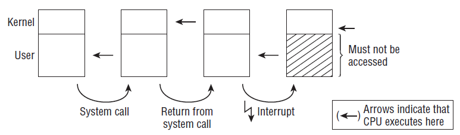
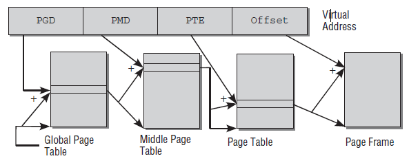

# 1 Tasks of the Kernel

> Main tasks of the kernel: abstraction + resource management.

- **Abstraction:** kernel abstracts the computer on a high level such that applications have no contact with the hardware itself
- **Resource manager:** kernel is an instance that shares available resources between various system processes while ensuring system integrity
- **Library:** provides a range of system-oriented commands (i.e. system calls), which appear to application programs as normal functions through the C standard library

# 2 Implementation Strategies

> Linux kernel is a monolithic kernel.

1. **Microkernels:** only the most elementary functions are implemented directly in a central kernel. All other functions are delegated to autonomous processes that communicate with the central kernel via clearly defined communication interfaces. Theoretically elegant but requires additional CPU time to support complex communication
2. **Monolithic Kernels:** entire code of the kernel, including all its subsystems such as memory management, filesystems or device drivers, is packed into a single file. Each function has access to all other parts of the kernel

Linux kernel is monolithic kernel but the concept of modules, which allow code to be inserted or removed while the system is up-and-running support mitigates some disadvantages of monolithic kernels.

# 3 Elements of the Kernel


## 3.1 Processes, Task Switch and Scheduling

> UNIX processes are each assigned an independent virtual address space. Kernel takes care of task switching and scheduling.

Programs running under UNIX are referred to as **processes**. Each process is assigned an address space in the **virtual memory**. Address spaces of different processes are totally independent so that processes has the impression of being the only process in the system. Kernel switches allow processes to have the impression of simultaneous processing. Two problem areas are:

- **Task Switching:** process state has to be saved and restored between switches
- **Scheduling:** decision of which process runs for how long

## 3.2 UNIX Processes

> UNIX processes are created by a parent process via `fork` (exact copy) or `exec` (replace).

Linux employs a hierarchical scheme in which each process depends on a parent process. The kernel starts the `init` program as the first process. `pstree` can show the process tree.


New process are generated through two mechanisms:

1. `fork`: generates an exact copy of the current process that differs from the parent process only in its PID. After execution of the syscall, there are two processes in the system both performing the same actions. The memory contents of the initial process are duplicated at least in the view of the program. `Copy on write` allows it to make the operation much more efficient by deferring the copy operations until either the parent or child writes to a page.
2. `exec`: loads a new program into the existing content and then executes it. The memory pages reserved by the old program are flushed and their contents are replaced with the new data. The new program then starts executing.

**Threads**

> Threads are light-weight processes sharing same address space but take different execution paths. They are created using `clone`.

Traditional UNIX process are **heavy-weight processes**. A thread is a **light-weight process**. A process may consist of several threads that all share the same data and resources but take different paths through the program (e.g. in Java process is the executing program and threads are routines inside the program). No communication effort is needed between the threads and the main program as they share the same address space and data received automatically reside in the main program. Only issue is to prevent threads from accessing identical memory locations. Linux provides the `clone` method to generate threads. This works similarly to `fork` but enables a precise check to be made of which resources are shared with the parent process and which are generated independently for the thread.

**Namespaces**

> Separating processes using namespaces allow for full virtualization using a single kernel.

Traditionally, Linux use numerous global quantities such as PID. With namespaces, formerly global resources are grouped differently. Every namespace can contain a specific set of PIDs or can provide different views of the filesystem. This is similar to full virtualization such as KVM but only a single kernel needs to run on the machine and manages all the containers.

## 3.3 Address Spaces and Privilege Levels

> Kernel resides at the top of virtual address space.


Linux divides its virtual address space into two parts known as **kernel space** and **userspace**. Every user process in the system has its own virtual address range that extends from 0 to `TASK_SIZE`. The area above is reserved exclusively for the kernel. `TASK_SIZE` is an architecture-specific constant that divides the address space in a given ratio.

**Privilege Levels**

> User programs enter kernel mode using system calls. Kernel can also be activated by interrupts to run in the interrupt context.

All modern CPUs offer several privilege levels in which processes can reside. There are various prohibitions in each level including execution of certain assembly language instructions or access to specific parts of virtual address space.


The switch from user to kernel mode is made by means of system calls. These are executed differently depending on the system. If a normal process wants to carry out any kind of action affecting the entire system (e.g. manipulating I/O devices), it can do so by issuing a request to the kernel with the help of a system call. The kernel first checks whether the process is permitted to perform the desired action and then performs the action on its behalf. A return is then made to user mode.



The kernel can also be activated by asynchronous hardware interrupts and is then said to run in **interrupt context.** The main difference to running in process context is that the userspace portion of the virtual address space must not be accessed. When operating in interrupt context, the kernel must be more cautious than normal, for instance, it must not go to sleep.

Besides normal processes there are also **kernel threads** running on the system. Kernel threads are also not associated with any particular userspace process. Kernel treads behave much like userland applications though they may go to sleep and are tracked by the scheduler. The kernel uses them for various purposes such as data synchronization of RAM and block devices or helping scheduler distribute processes among CPUs.

Kernel threads can be identified by `ps` because their names are placed inside brackets.


**Virtual and Physical Address Spaces**

> The kernel uses page table to map virtual memory pages to physical memory page frames.

In most cases, a single virtual address space is bigger than the physical RAM available to the system. The kernel uses page tables to allocate virtual addresses to physical addresses. Virtual address space and physical memory are divided into pages of the same size. A page table tracks the mapping between them. Physical pages are often called **page frames.** The term **page** usually refers to virtual memory.

## 3.4 Page Tables

> Multi-level page tables avoids the need for large contiguous memory block to store page tables.

> TLB is a caching mechanism to speed up address translation (by caching accesses to page tables). It is flushed during context switching.

Data structures known as page tables are used to map virtual address space to physical address space. Since each process needs its own page table, the primitive approach of a simple array is impractical/ To reduce the size of page tables and to allow unneeded areas to be ignored, the architectures split each virtual address into multiple parts. Most architectures offer a three-level page table.



First part of the virtual address is referred to as page global directory (PGD). Is is used as an index in an array that exists exactly once for each process. Its entries are pointers to the start of further arrays called page middle directories (PMD). The extends to the page table entry (PTE). Mapping between virtual pages and page frames is achieved here. The last part is known as an offset. It is used to specify a byte position within the page. A particular feature of page tables is that no page middle tables or page tables need to be created for areas of virtual address space that are not needed. This saves a great deal of RAM as compared to single-array method.

Downside of this method is that each time memory is accessed, it is necessary to run through the entire chain to obtain the physical address from the virtual address. CPU speeds this up by

1. **Memory Management Unit**
2. **Translation Lookaside buffer:** fast CPU cache that holds addresses that occur most frequently in address translation

**Interaction with the CPU**

IA-32 architecture uses a two-level-only method to map virtual addresses to physical addresses. However, 64-bit systems require three-level or four-level method. The architecture-independent part of the kernel always assumes a four-level page table. The architecture-dependent code must therefore emulate the missing levels by dummy page tables.

**Memory Mappings**

<!--- TODO: Clarify if MMIO lives in virtual or physical memory -->

Memory mappings are an important means of abstraction. Mapping is the method by which data from an arbitrary source are transferred into the virtual address space of a process. The address space areas in which mapping takes place can be processed using normal methods in the same way as regular memory. However, any changes made are transferred automatically to the original data source. For example, the contents of a file or IO peripheral can be mapped into memory.

## 3.5 Allocation of Physical Memory

> The kernel uses the buddy system to quickly detect the availability of memory ranges.

Kernel must keep track of which page have already been allocated and which are still free to prevent conflicts. Since memory allocation and release are very frequent tasks, the kernel must also ensure that they are completed as quickly as possible. the kernel can allocate only whole page frames. Dividing memory into smaller portions is delegated to the standard library in userspace.

**The Buddy System**


Numerous allocation requests in the kernel must be fulfilled by a continuous range of pages. To quickly detect where in memory such ranges are still available, the kernel employs the buddy system. Free memory blocks in the system are always grouped as two buddies. The buddies can be allocated independently of each other. If, however, both remain unused at the same time, the kernel merges them into a larger pair that serves as a buddy on the next level. All buddies of the same size (1,2,4,8,16,... pages) are managed by the kernel in a special list.

If the next request requires only 2 contiguous page frames, the block consisting of 8 blocks is split into 2 buddies with 4 each. One of the blocks is put back into the buddy lists while the other is again split into 2 buddies and one is returned while the other is passed to the application.

When systems run for longer periods, **fragmentation** occurs where there are no larger contiguous blocks of page frames. Single reserved pages that sit in the middle of an otherwise large continuous free range can eliminate coalescing of this range very effectively.

**The Slab Cache**

Often the kernel itself needs memory blocks much smaller than a whole page frame. Because it cannot use the functions of the standard library, it must define its own, additional layer of memory management that builds on the buddy system and divides the pages supplied by the buddy system into smaller portions. The method used not only performs allocation but also implements a generic cache for frequently used small objects known as slab cache:

1. For frequently used objects, the kernel defined its own cache that contains only instances of the desired type. Each time one of the objects is required, it can be quickly removed from the cache and returned after use. The slab cache automatically takes care of interaction with the buddy system and requests new page frames when the existing caches are full
2. For general allocation of smaller memory blocks, the kernel defined a set of slab caches for various object sizes that it can access using the same functions with which we are familiar from userspace programing, prefix k indicates that these functions are associated with the kernel: `kmalloc` and `kfree`

There are some scalability problems with the slab allocator on really large supercomputers and on tiny embedded systems (overhead). The kernel comes with two drop-in replacements for the slab allocator that provides better performance in these sue cases but offer the same interface to the rest of the kernel such that it need not be concerned with which low-level allocator is actually compiled in.

**Swapping and Page Reclaim**

**Swapping** enables available RAM to be enlarged virtually by using disk space as extended memory. Infrequently used pages can be written to hard disk when the kernel requires more RAM. Once the data are actually needed, the kernel swaps them back into memory. The concept of **page faults** is used to make this operation transparent to applications. Swapped-out pages are identified by a special entry in the page table. When a process attempts to access a page of this kind, the CPU initiates a page fault that is intercepted by the kernel. The kernel then has the opportunity to swap the data on disk in RAM. The use process then resumes.

**Page reclaim** is used to synchronize modified mappings with underlying block devices. Once data have been flushed, the page frame can be used by the kernel for other purposes.

## 3.6 Timing

The kernel must be capable of measuring time and time differences at various points, when scheduling processes, for example. **Jiffies** are one possible time base. A global variable named `jiffies_64` and its 32-bit counterpart `jiffies` are incremented periodically at constant time intervals. The various timer mechanisms of the underlying architectures are used to perform these updates (usually in the form of timer interrupts).

Usually, `jiffies` is incremented between 100 to 1kHz. It is possible to make the periodic tick **dynamic**. When there is little to do and no need for frequent periodic action, it does not make sense to periodically generate timer interrupts that prevent the processor from powering down into deep sleep states.

## 3.7 System Calls

> Linux syscalls follow the POSIX standard.

**System calls** are the classical method of enabling user processes to interact with the kernel. the POSIX standard defines a number of system calls and their effect as implemented on all POSIX-compliant systems. The categories are:

- **Process Management:** creating new tasks, querying information, debugging
- **Signals:** sending signals, timers, handling mechanisms
- **Files:** creating, opening and closing files, reading from and writing to files, quering information and status
- **Directories and Filesystem:** creating, deleting and renaming directories, querying information, links, changing directories
- **Protection Mechanisms:** Reading and changing UIDs / GIDs and namespace handling
- **Timer Function:** Timer functions and statistical information

## 3.8 Device Drivers, Block and Character Devices

> Linux peripherals are either character (continuous stream) or block (random access) devices.

The role of device drivers is to communicate with I/O devices attached to the system. For example, hard drives, floppies etc. In accordance with the classical UNIX maxim that every is a file, access is performed using device files that usually reside in the `/dev` directory and can be processed by programs in the same way as regular files. Peripheral devices belong to one of two groups:

1. **Character Devices:** deliver a continuous stream of data that applications read sequentially.
2. **Block Devices:** allow applications to address their data randomly and to freely select the position at which they want to read data.

## 3.9 Networks

Network cards are also controlled by device drivers but assume a special status in the kernel because they cannot be addressed using device files. This is because data are packed into various protocol layers during network communications. when data are received, the layers must be disassembled and analyzed by the kernel before the payload data are passed to the application. When data are sent, the kernel must first pack the data into the various protocol layers prior to dispatch. To support work with network connections via the file interface, Linux uses **sockets** from the BSD world.

## 3.10 Filesystems

> The kernel exposes a standard interface (Virtual file system) for software to interact with the filesystem.

Linux systems are made up of many files stored on block devices. Hierarchical filesystems are used, allowing stored data to be organized into directory structures and also have the job of linking other meta-information with the actual data. Many different filesystems approaches are supported by Linux, e.g. Ext2, Ext3, ReiserFS, XFS and VFAT etc. Ext2 is based on inodes, that is , it makes a separate management structure known as an inode available on disk for each file. The inode contains not only all meta-information but also pointers to the associated data blocks. Hierarchical structures are set up by representing directories as regular files whose data section includes pointers to the inodes of all files contained in the directory.

The kernel must provide an additional software layer to abstract the special features of the various low-level filesystems from the application layer (and also from the kernel itself). This layer is referred to as the VFS (virtual filesystem).


## 3.11 Modules and Hotplugging

Modules are used to dynamically add functionality to the kernel at run time - device drivers, filesystems, network protocols etc. Modules are simply normal programs that execute in the kernel space rather than in userspace. They must also provide certain sections that are executed when the module is initialized (and terminated) in order to register and de-register the module functions with the kernel. Otherwise, module code has the same rights as normal kernel code and can access all the same functions and data as code that is permanently compiled into the kernel. It is obvious why kernels are essential for hotplugging.

A long-standing issue in the kernel community revolves around the support of binary-only modules, that is, modules for which no source code is available. There are good reasons why this is stupid. It is currently possible to load binary-only modules into the kernel, although numerous restrictions apply for them. They also may not access any functions that are explicitly only made available to GPL-licensed code. Loading a binary-only module **taints** the kernel. If something bad happens to a tainted kernel, developers will be very unsupportive in solving the issue that led to the crash.

## 3.12 Caching

The kernel uses **caches** to improve system performance. Because the kernel implements access to block devices by means of page memory mappings, caches are also organized into pages, thus the name **page cache.** The far less important **buffer cache** is used to cache data that are not organized into pages. On traditional UNIX systems, the buffer cache serves as the main system cache, and the same approach was used by Linux a long, long time ago. By now, the buffer cache has mostly been superseded by the page cache.

## 3.13 List Handling

> The kernel defines a structure for doubly linked lists.

A recurring task in C programs is the handling of doubly linked lists. The kernel too is required to handle such lists. Standard lists as provided by the kernel can be used to link data structures of any type with each other (explicitly not type-safe). The data structures to be listed must contain an element of the `list_head` type which accommodate for the forward and back pointers.

```cpp
// list.h
struct list_head {
    struct list_head *next, *prev;
}
```

The starting point for linked lists is again an instance of `list_head` (not the custom data structure..., a `list_head` containing a `list_head`) usually declared and initialized by the `LIST_HEAD(list_name)` macro. In this way, the kernel produces a cyclic list which permits access to the first and last element of a list in $\mathbb{O}(1)$.


There are several standard functions for handling and processing lists (arguments are of data type `struct list_head`:
- `list_add(new, head)`: inserts `new` right after `head`
- `list_Add_tail(new, head)`: inserts `new` right before the element specified by `head`
- `list_del(entry)`: deletes an entry from a list
- `list_empty(head)`: checks if a list is empty
- `list_splice(list, head)`: combines two lists by inserting the list in `list` after the `head` element of an existing list
- `list_entry(ptr, type, member)` must be used to find a list element. `ptr` is pointer to `list_head` instance of the data structure, `type` is its type, `member` is element name used for the list element (e.g. `struct tas_struct - list_entry(ptr, struct task_struct, run_list`)
- `list_for_each(pos, head)`: iterate through all elements of a list. `pos` indicates current position in the list.

## 3.14 Object Management and Reference Counting

> Linux kernel objects contains the `kobject` struct for common operations such as reference counting.

The generic kernel object mechanism provides the following operations:

- Reference counting
- Management of lists of objects
- Locking of sets
- Exporting object properties into userspace

**Generic Kernel Objects**

```cpp
// kobject.h
struct kobject {
    const char          *k_name; // text name exported to userspace using sysfs
    struct kref         kref;    // for reference management
    struct list_head    entry;   // standard list
    struct kobject      *parent; // pointer to parent
    struct kset         *kset;   // required when object grouped with other objects iun a set
    struct kobj_type    *ktype;  // more detailed information on data structure
    struct sysfs_dirent *sd;
}
```

```cpp
// kref.h
struct kref {
    atomic_t refcount;
}
```

`refcount` is an atomic data type to specify the number of positions in the kernel at which an object is currently being used. When counter reaches 0, object can be removed from memory;

Standard `kobject` methods:

- `kobject_get, kobject_put`: increments or decrements reference counter
- `kobject_(un)register`: registers or removes `obj` from a hierarchy
- `kobject_init`: initialization
- `kobject_add`: initializes a kernel object and make it visible in sysfs
- `kobject_cleanup`: releases the allocated resources

**Sets of Objects**

```cpp
// kobject.h
struct kset {
    struct kobj_type       *ktype;
    struct list_head       list;
    // ...
    struct kobject         kobj;
    struct kset_uevent_ops *uevent_ops; // provides function pointers to methods that relay information about the state of the set to userland
}
```

```cpp
// kobject.h
struct kobj_type {
    // ...
    struct sysfs_ops *sysfs_ops;
    struct attribute **default_attrs;
}
```

`kobj_type` provides an interface to the sysfs filesystem.

## 3.15 Data Types

**Type Definitions**

The kernel uses `typesdef` to define various data types in order to make itself independent of architecture-specific features (e.g. bit lengths for standard data types). Sometimes, especially when communicating with external devices, exact number of bits are required. These include `__s8`, `__u8` etc. Otherwise, kernel only concerns itself with `typedef` which can have various bit lengths.

**Byte Order**

`cpu_to_le64`: 64-bit data type to little endian

`le64_to_cpu`: reverse

**Per-CPU Variables**

These variables defined using `DEFINE_PER_CPU(name, type)` are instantiated once per CPU.


