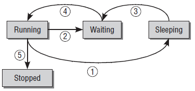

# 1 Process Priorities

- **Hard real-time processes**: subject to strict time limits during which certain tasks must be completed (e.g. flight control commands of aircraft else plane would crash).  Vanilla linux kernel does not support hard real-time processing (guaranteeing that these processes are completed within specified timeframe).

- **Soft real-time processes**: quick results are required but not the end of the world if they are late (e.g. writting to a CD, at most corruption of the CD if timing not respected). But still these processes should have priority to CPU time above all other normal processes

- **Normal processes**: no specific time constraints but can still be classified as more or less important by assigning priorities (low-priorities e.g. long compiler runs / calculations)

# 2 Process Life Cycle
- **Running**
- **Waiting**: able to run but not allowed to
- **Sleeping**: cannot run because waiting for external event (can / cannot be interrupted)
- **Stopped**
- **Zombie**: stopped (resources released) but still in process table. Occurs when process is killed by user / another process (`SIGTERM` or `SIGKILL`) but parent process has not invoked `wait4` to acknowledge death of child.

# 3 Preemptive Multitasking
In addition to process priorities, the system's current privilege level is also relevant (**please distinguish between kernel code and kernel mode**). Normally, after boot (which happens in machine mode -> supervisor mode, ignoring hypervisor), kernel code are running in user mode (process 0, the father of all processes, and GUIs etc.). There are two circumstances under which the system goes into supervisor mode and is allowed to fiddle with all the system's sensitive resources (e.g. file systems, IOs etc.)

1. **System calls** (calls to supervisor binary interface / SBI): usually an instruction set (RISC-V / ARM) has a special syscall instruction (called `ecall` in RISC-V). When this instruction is executed, system transition to supervisor mode trap handler (the address of which is stored in / calculated from some registers). In the trap handler, the kernel code reads the argument registers and determine the desired function from the user program. The convention on how and where the registers are used is called the SBI and defined by whatever kernel code you are using. Similarly, there is an `ecall` interface to go from supervisor mode to machine mode. This interface (i.e. how registers are used) is called ABI and provided by the bootloader (e.g. bbl for RISC-V)
2. **Interrupts**: the system changes to supervisor or machine mode (depending on the interrupt type and delegation registers, see `mcause` and `mideleg` for RISC-V) upon encountering an interrupt (which is no more than setting one / some bits in a register to HIGH). Interrupts (in RISC-V) comes from a few sources:
   1. Timer interrupts: based on some register values (e.g. `mtimecmp` in CLINT for RISC-V), timer interrupts might be triggered, to indicate the passage of a certain duration. In RISC-V this is handled in machine mode (always, if I am not wrong).
   2. Software interrupts: used by multicore processors to poke another core (by sending software interrupts and setting `mcause` or whatever register to indicate what happened). See `msip` in CLINT for RISC-V. Always handled in machine mode in RISC-V.
   3. External interrupts: interrupts from external devices. Usually the interrupt lines from the on-chip IO devices (i.e. hard-wired and built into the SoC, not hot-pluggable) are routed through an interrupt controller (e.g. PLIC in RISC-V) which raises an interrupt bit (see `meip` in RISC-V) and set some MMIO register (in the controller) to allow the CPU to read the id of the interrupt source. Note that off-chip devices (e.g. stuff attached to PCIe bus or whatever) have to be routed through the port that they are attached to (e.g. handled by PCIe controller, but CPU will know that PCIe raised an interrupt, then PCIe driver will check which PCIe device on the bus raised the interrupt). External interrupts can be delegated to supervisor mode to handle (to shave off a few cycles of interrupt handling time)

Preemptive scheduling is basically establishing a hierarchy that determines which process states can be interrupted by which other states:
- **Normal processes**: can always be interrupted, even by other runnable processes of higher priority
- **Kernel Mode (Syscall)**: can only be interrupted by an interrupt
- **Interrupt**: highest priority (can be interrupted by another interrupt depending on the handler function, i.e. whether they re-enable interrupts while handling, but this nested behavior is not a concern of the scheduler but that of the kernel trap handler logic)

*Kernel preemption*: added to kernel 2.5 to support switching to another process during syscall execution but adds kernel complexity.

# 4 Process Representation
Processes have `task_struct` defined in `include/sched.h`, stores information on:
- **State and execution information**: pending signals, binary formats, pid, pointers to related processes, priorities, time information, resource limits (`rlimit` in `resource.h`)
- **Allocated virtual memory information**
- **Process credentials**: user and group ID etc.
- **Files used**
- **Thread information**: CPU-specific runtime data
- **Interprocess communication information**
- **Signal handlers**: pointers to handler functions?

# 5 Process Types
Process types are determined by the syscall used to generate them:
- **Fork**: identical copy of current process (child process) but have separate copies of data in memory (copy-on-write)
- **Exec**: replaces running process with another application loaded from executable binary file (so have to `fork` then `exec`)

`clone` is similar to `fork` but can share some resources with parents.

# 6 Namespace, PID, Task Relationships, Process Management Syscalls (skipped)

# 7 Completely Fair Scheduling

The CFS scheduler do away with the concept of priorities in normal processes (syscall and interrupts dont really need scheduling). At each timeslice (default 20ms), there will be a number `N` of contending processes (read: runnable). The scheduler runs each of them in ascending order of their `vruntime`. After execution, the actual time that they spent is added (after some heuristics involving decays and some minimum values) to the `vruntime`. The CFS maintains (O(logn)) a red-black tree to order the active processes by `vruntime`. Yeah, think about it more and you will realize how this is fair (and doesn't hang because every runnable process gets to run in every timeslice but are appropriately prioritized). It is another story if `N` is too large but it generally works well enough, let's not waste time on the specifics.

Note that RTOS such as freeRTOS and Zephyr RTOS seem to have a different way of scheduling, probably using some variety of the old O(1) linux core scheduler (which is simply a queue for each priority level?).

