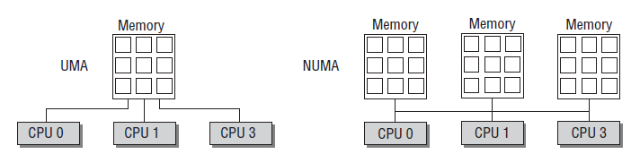

# 1 Overview
As we know, the virtual address space of the processor is divided into two parts of the Linux Kernel (necessary bootloader code are copied or mapped when kernel is started so they do not come into the picture): kernel and user space. The kernel space and occupies the top (e.g. 0xffff800000000000 on 64-bit systems) of the 64-bit virtual address space (you have millions of TB below that).

The linux kernel maintains a (multiple if multi-level) page-table that stores all entries of physical address block translations. 

**EXPLAIN MEM TRANSLATION**

