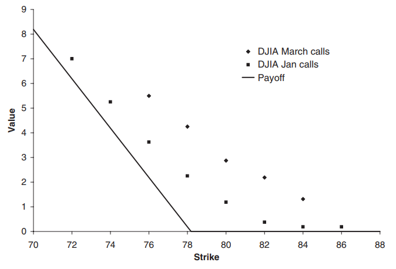
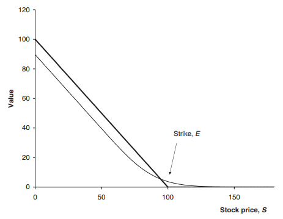
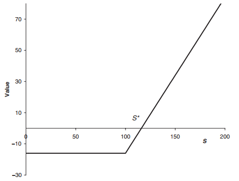
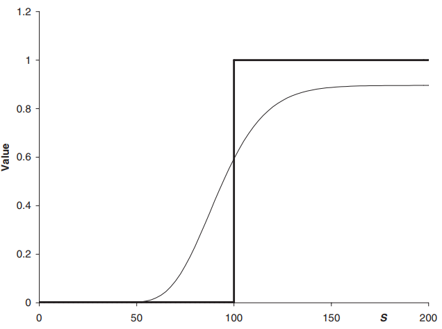
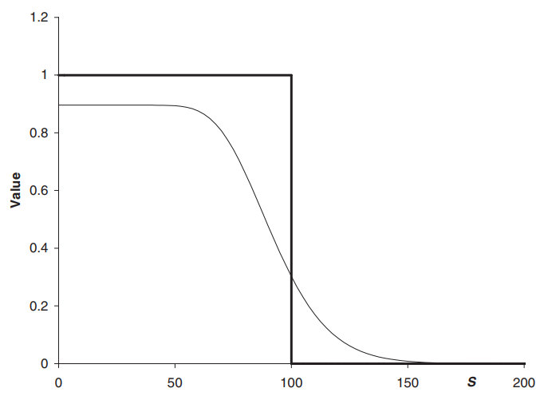
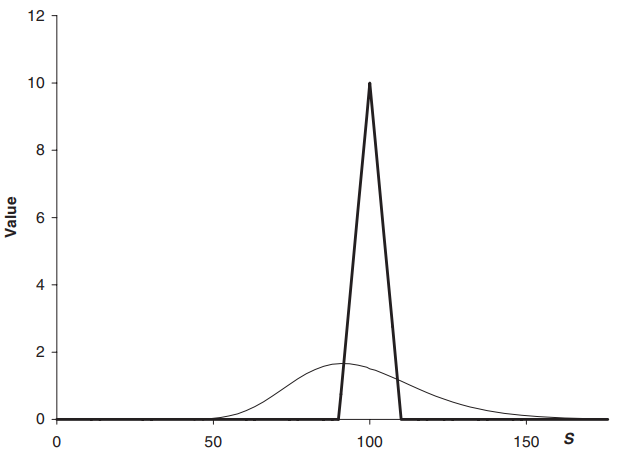
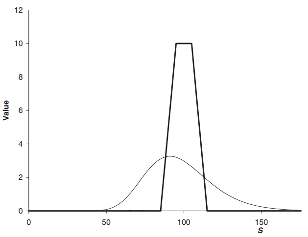

# 1 Options

Previously, we introduced the idea of futures (or forwards) where parties are obliged to trade at the maturity of the contract (unless the position is closed before that). However, in some scenarios, we instead would like to have the **option** to taken possession of the asset only if the prices have risen.

**Call Option**:  right to buy asset at strike price for an agree amount at / before expiration date. Payoff function for call option is $ max(S - E, 0) $ at expiry date where $ S $ is the stock price and $ E $ is the strike price.

**Put Option**:  right to sell asset at strike price for an agree amount at / before expiration date. Payoff function for put option is $ max(E - S, 0) $ at expiry date where $ S $ is the stock price and $ E $ is the strike price.

Towards expiry date, the uncertainty around the settlement price converges to 0 and hence the option value converges to the payoff function (I am sure there are some measure theory theorem that asserts this convergence by distribution / probability).

# 2 Common Terms
- **Premium**: amount paid for the contract initially (i.e. price)
- **Underlying**: the financial instrument on which the option value depends on
- **Intrinsic value**: payoff that would be received if the underlying is at its current level when the option expires (i.e. assume no further changes in price)
- **Time value**: any value of the option above intrinsic value
- **In the money**: option with positive intrinsic value
- **Out of the money**: option with no intrinsic value, only time value (note that intrinsic value cannot be negative)
- **Long position**: positive exposure to a quantity (i.e. you gain when asset prices rise)
- **Short position**: negative exposure to quantity

# 3 Payoff Diagram

The payoff diagrams shows the option's payoff at expiry date. The curved line is the option's value at the current time (calculated using models like Black Scholes).

Taking into account the option's (current) premium, we get the profit diagram. Note that the curved line should intersect the x-axis at the current stock price (theoretically).

# 4 Writing Options
Whenever someone purchases an option, a counterparty has to write the option. The person buying the option hands over a premium in return for an uncertain outcome. The writer receives an upfront payment to provide potential obligations in the future.

# 5 Margin
Writing an option is very very risky. A purchaser of an option has a limited downside (of the premium amount). However, the writer of an option has an unlimited downside (and a limited upside). As such, option writers must deposit margins similar to futures.

# 6 Market Conventions
Options traded on exchanges has standardized and limited strike prices and expiry dates. The reason for this is to promote liquidity.

# 7 Option Value Before Expiry
Factors affecting option value:
- **Variables (time-dependent)**:
  - time t: proportional to total volatility
  - asset price at time t
  - (expected, annualized) volatility at time t: likelihood of going above (note that payoff is asymmetric, that's why volatility has value)
- **Parameters (constant-time)**:
  - strike price
  - interest rate (sort-of?)
  - dividend yield
  - expiry date

# 8 Speculation and Gearing
Options allow for highly-geared / leveraged trading because:
1. Purchaser of options do not need to post margins (premium paid is all you can lose)
2. Purchasing a far out-of-the-money option costs very little but has a large (unlikely) potential upside

Hence, writing highly leveraged contracts is very risky (risk huge loss for small profit). Of course it is also bad if you put 100% of your money in leveraged options (you at most lose 100% but you most likely will do so...). Writers of such contracts can hedge the risk by buying other related contracts.

# 9 Early Exercise

**European Options**: exercise is only permitted at expiry. This is the simple options we will mostly be dealing with

**American Options**: exercise any time before expiry. Also more valuable than European Options for obvious reasons. But there is this complication to decide on the **optimal exercising time**.

**Bermudan Options**: allow exercise on specified dates / periods.

# 10 Put-Call Parity

Buying (long) a call and writing (short) a put option at the same expiry and strike price gives the same payoff as holding a stock. As such, the cashflows should be equivalent (by law of conservation of money).

$$ C - P = S - Ee^{-r(T-t)} $$

- $ C $: call option value today
- $ P $: put option value today
- $ S $: stock value today
- $Ee^{-r(T-t)}$: present value to lock in payment of $ E $ at time $ T $ (strike, expiry)

# 11 Binaries or Digitals
Binary or digital options have a unit step function as its payoff function, paying $1 at expiry if the asset price is above / below the strike price.

The put call parity equation for the binary option is simple (as it promises a fixed sum of $1 instead of an asset):

$$ C + P = e^{-r(T-t)} $$

Note that binary options might pay off more when betting on small fluctuations, vanilla options pay more at extreme levels.

# 12 Bull and Bear Spreads
Having looked at vanilla and binary calls and puts, we can now look at portfolio of options or option strategies. We can achieve a payoff similar to a binary option using vanilla options

**Bull Spread**: buy call with strike $ E_1 $ and write call with strike $ E_2 $ ($ E_2 > E_1 $), payoff is 

$$ max(S-E_1,0) - max(S-E_2,0) $$

**Bear Spread**: write put option with strike $ E_1 $ and buy put with strike $ E_2 $ ($ E_2 > E_1 $).

Note that strategies involving options of the same type are called **spreads**.

# 13 Straddles and Strangles

**Straddle**: call and put at same strike, usually bought at-the-money, i.e. at the current stock price (duhh). A straddle simply predicts a more-than-expected move in the asset price, e.g. before announcement of major news (which can move prices in either direction, e.g. a merger that might be good / bad??). "More-than-expected" means that you expect greater volatility than what is already accounted for in the price by the market. Of course value is lost if the news is strictly beneficial / bad.

**Strangle**: similar to straddle except that strikes of call and put are different. Contract can be out-of-the-money strangle or in-the-money. The out-of-the-money strangle is usually bought when the asset is around the middle of the two strikes and is (of course) cheaper than the straddle (else just buy a straddle for higher profits). Of course, to benefit from a straddle, you need a higher expected volatility.

Note that straddle and strangles (assume the asset price is somewhere in the middle), does not involve a view on the direction of the underlying. This is one of the simplest volatility trades.

A strategy that involves different types of options is called a combination.

# 14 Risk Reversal
Risk reversal is a combination of a long call, with a strike above the current spot, and a short put, with a strike below the current spot at the same expiry. 

# 15 Butterflies and Condors
**Butterfly Spread**: purchasing and sale of options with three different strikes. E.g. call with strike 90, write 2 calls strikes at 100 and buy 110 call:

This kind of position is rather cheap to enter but has no large upside potential. With options, cheap is good (high leverage).

**Condor**: butterfly that uses four strikes and four call options.

# 16 LEAPS and FLEX
**LEAPS (long-term equity anticipation securities)**: long-dated exchange-traded calls and puts. Standardized to expire in Jan each eyar and available with expiries up to three years. They are available with three strikes: at the money, 20% in and out of the money when issued.

**FLEX (Flexible Exchanged-traded Options)**: options on indicies that allow a degree of customization in expiry date, strike and exercise style.

# 17 Warrants
Warrants are call options issued by a company on its own equity. Warrant usually have a longer lifespan and on exercise the company issues new stock to the warrant holder (warrants are important when considering the IPO of SPACs). On exercise, holder of a traded option receives stock that has already been issued. Exercise is usually allowed any time before expiry but after an initial waiting period. Occasionally perpetual warrants are issued, having no maturity.

# 18 Convertible Bonds
Convertible bonds have features of both bonds and warrants. They pay a stream of coupons with final repayment of principal at maturity but can be converted into underlying stock before expiry. On conversion rights to future coupons are lost.

# 19 Over the Counter Options
Not all options are traded on an exchange. Some OTC options are sold privately from one counterparty to another. A term sheet specifies the precise details of an OTC contract. For example, 

Note that the put option in this OTC option is cheaper than a vanilla put option partly since the premium does not have to be paid until / unless underlying index trades above specified level.