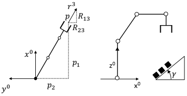
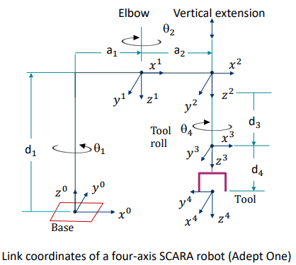

# 1 The Inverse Kinematics Problem

Given a desired position $p$ and orientation $R$ of the tool, find the values for the join variables $q$ which satisfy the arm equation $T_{base}^tool(q)$.

# 2 General Properties of Solutions

$$ T_{base}^{tool}(q) = \begin{bmatrix} R_{11} & R_{12} & R_{13} & p_1 \\\ R_{21} & R_{22} & R_{23} & p_2 \\\ R_{31} & R_{32} & R_{33} & p_3 \\\ 0 & 0 & 0 & 1\end{bmatrix}$$

- Existence of Solutions
  - desired position outside work envelope
    - no solution
  - desired position within work envelope
    - some solutions might violate one or more joint variable limits
    - equations and unknowns
      - arm equation constitutes a system of 12 simultaneous nonlinear algebraic equations in the n unknown components of q ($R\_{11}$ to $R\_{33}$)
      - but given 6 constraints: 3 pairs of orthogonality ($r\_i \cdot r\_j=0$), 3 unit vectors ($||r_j||=1$)
      - hence, overall 6 nonlinear equations for n unknowns. To achieve general manipulation, $n \ge 6$
      - but still, no guarantee that a closed-form expression exist
    - lower bound on number of axes n necessary but not sufficient condition for existence of solution
- Uniqueness of solution
  - there can be unique solutions even if the robot is not kinematically redundant

# 3 Tool Configuration

- we only need 6 variables to represent 6 d.o.f.
- Tool Configuration Vector:
  - Tooltip position: translation vector $p$
  - Using approach vector (last row of $R$), we can specify tool yaw and pitch angle (except from roll)
  - Encode tool roll information ($q_n$) by scaling approach vector (since approach vector is unit vector)
    - $f(q\_n)=e^{q\_n/\pi}$
- $w=\begin{pmatrix} w^1 \\\ w^2 \end{pmatrix}=\begin{pmatrix} p \\\ exp(q_n/\pi)*r^3 \end{pmatrix} \in \mathbb{R}^6$

# 4 Examples

## 4.1 Five-Axis Articulated Robot

- Tool configuration
  - $R\_{13}p\_2=R\_{23}p\_1$
  - $w= \begin{bmatrix} w\_1 \\\ w\_2 \\\ w\_3 \\\ \beta w\_1 \\\ \beta w\_2 \\\ w\_6 \end{bmatrix}$

## 4.2 Four-Axis SCARA Robot

- Tool Configuration

  - $r\_3 = -i\_3$
  - $w=\begin{bmatrix} p\_1 \\\ p\_2 \\\ p\_3 \\\ 0 \\\ 0 \\\ -e^{\frac{q\_4}{\pi}} \end{bmatrix} = \begin{bmatrix} a\_1C\_1 + a\_2C\_{1-2} \\\ a\_1S\_1 + a\_2S\_{1-2} \\\ d\_1-q\_3-d\_4 \\\ 0 \\\ 0 \\\ -e^{\frac{q\_4}{\pi}} \end{bmatrix}$

- Inverse Kinematics
  - $q\_2=\pm arccos \frac{w\_1^2 + w\_2^2 - a\_1^2 - a\_2^2}{2a\_1a_2}$
    - left-handed vs right-handed solutions
  - $q\_1=atan2[a\_sS\_2w\_1 + (a\_1 + a\_2C\_2)w\_2, (a\_1+a\_2C\_2)w\_1-a\_2S\_2w_1]$
  - $q\_3=d\_1-d\_4-w\_3$
  - $q\_4=\pi \ln |w\_6|$

# 5 Robot Work Cell

Transformation matrix can also be applied more generally to coordinate transformation between various stations in robotic cell (e.g. from camera coordinates to base coordinates)

## 5.1 Example

- $T_{camera}^{part}= \begin{bmatrix} 0 & -1 & 0 & 0 \\\ -1 & 0 & 0 & -5 \\\ 0 & 0 & -1 & 19 \\\ 0 & 0 & 0 & 1 \end{bmatrix}$
- $T_{camera}^{base} = \begin{bmatrix} 0 & -1 & 0 & 15 \\\ -1 & 0 & 0 & 25 \\\ 0 & 0 & -1 & 20 \\\ 0 & 0 & 0 & 1 \end{bmatrix}$
- $T\_{base}^{part}=T\_{base}^{camera}T_{camera}^{part}=\begin{bmatrix} 1 & 0 & 0 & 30 \\\ 0 & 1 & 0 & 15 \\\ 0 & 0 & 1 & 1 \\\ 0 & 0 & 0 & 1 \end{bmatrix}$
- $T_{base}^{grasp}=\begin{bmatrix} 1 & 0 & 0 & 30 \\\ 0 & -1 & 0 & 15 \\\ 0 & 0 & -1 & 1 \\\ 0 & 0 & 0 & 1 \end{bmatrix}$
